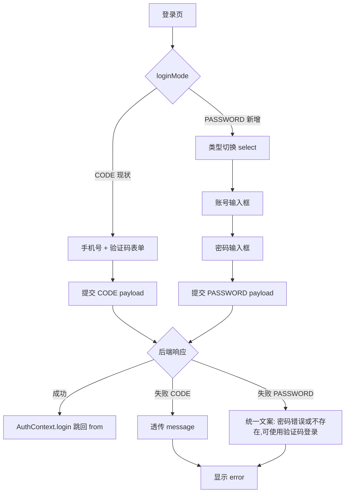

# 前端登录页账号密码登录 设计

## 0. 需求摘要与决策

**用户目标**：已设置密码的用户能在登录页用「手机号或邮箱 + 密码」登录，不强制依赖验证码通道。

**核心行为**：
- 登录页顶部「验证码登录 / 密码登录」两个 tab，默认停在验证码登录（保留现有体验）
- 验证码 tab = 现状行为不变
- 密码 tab = 账号类型切换（手机号 / 邮箱）+ 账号输入框 + 密码输入框 + 登录按钮
- 账号类型切换控件的取值决定提交时 `identifierType` 传 `PHONE` 还是 `EMAIL`

**成功标准**：
- 密码 tab 下选「手机号」、填注册过的手机号 + 正确密码 → 登录成功，跳回 `from`
- 密码 tab 下选「邮箱」、填注册过的邮箱 + 正确密码 → 登录成功
- 密码错误 / 账号不存在 / 账号未设密码 → 统一提示「密码错误或不存在，可使用验证码登录」，并保证 tab 切换入口可用
- 验证码 tab 行为与改动前完全一致（回归无破坏）

**明确不做**（反向可核对）：
- 不动后端任何代码（`AuthController` / `AuthService` / `LoginRequest` DTO / `IdentifierType` 枚举）
- 不动 `services/authService.ts`、`context/AuthContext.tsx`、`types/auth.ts`（`LoginRequest` 联合类型已支持 password 分支）
- 不接重置密码 `POST /auth/password/reset`（前端无此入口属另一个 feature）
- 不做「忘记密码」链接 / 找回密码流程
- 不用前端类型里的 `USERNAME`（后端 `IdentifierType.fromString` 不认，会 400）
- 不用知光号 `zgId` 登录（后端无 `findByZgId` 登录通道）
- 不做账号格式的前端硬校验阻断提交（格式错误交后端 `BAD_REQUEST` 返回，前端照常显示 message）—— 见风险 R2
- 不引入新的 npm 依赖

**复杂度档位**：走默认档位（单页 UI 改造，无对外 SDK / 无高并发 / 非一次性工具）。

**owner 已定决策**：
1. 账号框：phone + email 都接受，需类型切换控件（后端 `findUserByIdentifier` 严格按 `identifierType` 查，不能自动猜）
2. UI 形态：验证码登录 / 密码登录 tab 切换
3. 没设密码退路：路线 A——纯前端一刀切提示「密码错误或不存在，可使用验证码登录」+ tab 切换入口；后端 `INVALID_CREDENTIALS` 不区分「密码错」与「未设密码」，前端统一覆盖文案

---

## 1. 决策与约束

### 1.1 这功能放在哪儿

扩展现有 `zhiguang_fe/src/pages/LoginPage.tsx`。登录页本就承担认证入口职责，密码登录是同域能力的补全，不另起模块、不抽公共组件。改动收敛在单文件 + 其 CSS module。

### 1.2 关键约束（来自代码事实）

| 约束 | 来源 | 对设计的影响 |
|---|---|---|
| 后端 `IdentifierType` 只有 `PHONE`/`EMAIL` | `IdentifierType.java` | 账号类型切换控件只给这两个选项 |
| 后端 `findUserByIdentifier` 严格按 type 查 | `AuthService.java:334-339` | 切换控件值 = 提交的 `identifierType`，不能省 |
| 后端密码登录与未设密码同返 `INVALID_CREDENTIALS` | `AuthService.java:159-164`（`\|\|` 短路同抛） | 路线 A：前端统一文案，无法精准区分 |
| 后端 `BusinessException` 一律返 HTTP 400（不分错误码），错误体 `{code,message}` | `GlobalExceptionHandler.java:27-33`、`ErrorCode.java` | **不能按 HTTP status 区分错误类型**，只能按 `errorData.code` 区分 |
| 前端 `ApiError` 携带 `status:number` + `data:{code,message}` | `apiClient.ts:15-24, 90-101` | PASSWORD 模式 catch 里取 `err.data.code` 分流，非 ApiError 回退统一文案 |
| 前端 `LoginRequest` 联合类型已支持 password 分支 | `types/auth.ts:61-73` | 类型层零改动 |
| `AuthContext.login(payload)` 透传 payload | `AuthContext.tsx:150-161` | 调用层零改动 |
| 注册时密码必填 | `RegisterPage.tsx:91` | 存量用户几乎都有 `passwordHash`，密码登录可用面充足 |
| 前端 `IdentifierType` 含 `USERNAME` 死代码 | `types/auth.ts:1` | 切换控件 options 不含 USERNAME |

### 1.3 基线与验证命令

- 类型检查主命令：`cd zhiguang_fe && npm run lint`（= `tsc --noEmit`）
- 构建：`cd zhiguang_fe && npm run build`（= `tsc && vite build`）
- 前端 0 测试文件，无单测框架 → 验收以 `npm run lint` + 手工浏览器联调为主
- 联调：后端 `mvn spring-boot:run`(8080) + 前端 `npm run dev`(5173)，vite proxy `/api`→8080
- 抠登录验证码（验证码 tab 回归用）：`docker exec zhiguang-redis redis-cli HGET "auth:code:LOGIN:{phone}" code`
- **基线风险**：`npm run lint` 实现前先预检一次；若已红，分清是既有问题还是本次引入

### 1.4 Top 3 风险

- **R1 密码 tab 与验证码 tab 状态串扰**：两个 tab 共用 `identifier` state，切 tab 时若不清空/不重置可能导致验证码 tab 的 `code` 残留影响密码 tab 的 `isDisabled` 判断。缓解：切 tab 时清空对侧字段（密码 tab 清 `code`，验证码 tab 清 `password`），checklist step 2 覆盖。
- **R2 账号格式前端不校验直接提交**：用户在「手机号」tab 填了邮箱格式的字符串，后端 `validateIdentifier` 返回 `BAD_REQUEST`「手机号格式错误」。这是可接受行为（提示照常显示），但要在 step 3 验收里显式覆盖一次，确认提示可读、不白屏。
- **R3 切换控件可访问性**：项目已有 `components/common/Select.tsx`（带键盘导航/aria），但 LoginPage 现有 CSS 的 `.select` 类未在 tsx 中使用。需确认是用现有 Select 组件还是原生 `<select>`。缓解：倾向原生 `<select>` + 现有 `.select` CSS 类（零新依赖、零新文件、键盘可访问），step 1 决定。

### 1.5 关键假设（用户可改）

- **假设**：默认 tab 停在「验证码登录」而非「密码登录」——理由是保留现有用户习惯，密码登录是补充入口。若希望默认密码登录，告诉我改。
- **假设**：密码登录失败统一文案「密码错误或不存在，可使用验证码登录」，不在文案里加「去验证码登录」的可点链接（因为 tab 就在上方，链接冗余）。若想要可点链接，告诉我改。
- **假设**：账号类型切换用原生 `<select>`（手机号/邮箱两项），不引入 Select 组件。理由是两项固定值，原生 select 最简且 `.select` CSS 已存在。

### 1.6 交付物清单

- 修改：`zhiguang_fe/src/pages/LoginPage.tsx`（加 tab 状态、密码 tab 表单、类型切换、统一错误文案）
- 修改：`zhiguang_fe/src/pages/LoginPage.module.css`（加 tab 样式、select 适配，复用现有 `.select`）
- 不新增文件、不新增依赖、不动后端、不动 service/context/types

### 1.7 清洁度规则

- 不新增 `console.log` / 调试输出
- 不留 TODO/FIXME
- 不注释掉旧代码（验证码 tab 的现有逻辑保留为活跃代码，不注释）
- 不引入无用 import
- 例外：无

---

## 2. 现状 → 变化

### 2.1 名词层（值对象 / 状态 / 类型）

**现状**：
- LoginPage 组件 state：`identifier`、`code`、`error`、`submitting`、`sendingCode`、`countdown`（`LoginPage.tsx:16-21`）
- 提交 payload 硬编码 `{ identifierType: "PHONE", identifier, code }`（`LoginPage.tsx:43`）
- `LoginRequest` 联合类型已支持 `{ identifierType, identifier, password, code?: never }` 分支（`types/auth.ts:61-73`）

**变化**：
- 新增 state：`loginMode: "CODE" | "PASSWORD"`（tab 状态，默认 `"CODE"`）
- 新增 state：`identifierType: "PHONE" | "EMAIL"`（账号类型，默认 `"PHONE"`，仅密码 tab 用）
- 新增 state：`password: string`
- `identifier` state 两个 tab 共用且切 tab 时保留（用户可能两 tab 用同一账号）；仅清空对侧的 `code`/`password` 及 `error`
- 提交 payload 按 `loginMode` 分流：
  - `CODE` → `{ identifierType: "PHONE", identifier, code }`（现状不变；验证码 tab 暂只支持 PHONE，见 2.4）
  - `PASSWORD` → `{ identifierType: identifierType, identifier, password }`
- 错误文案：`PASSWORD` 模式 catch 到任何错误，统一覆盖为「密码错误或不存在，可使用验证码登录」；`CODE` 模式维持现状（透传后端 message）

> 类型层不动：`identifierType` 取值限制在 `"PHONE" | "EMAIL"`，TS 上用字面量联合局部变量即可，不碰全局 `IdentifierType`（它含 `USERNAME` 死代码，本次不清理）。

### 2.2 编排层（主流程）

**现状编排**（`LoginPage.tsx:37-74`）：
1. `handleSubmit` → 构造 CODE payload → `login(payload)` → 跳转 / catch 显示 message
2. `handleSendCode` → `authService.sendCode({scene:"LOGIN", identifierType:"PHONE", identifier})` → 倒计时

**变化编排**：
1. `handleSubmit` 按 `loginMode` 分流构造 payload；`CODE` 分支不变，`PASSWORD` 分支构造 password payload
2. catch 分流：`PASSWORD` 模式统一文案，`CODE` 模式透传
3. tab 切换 handler：`setLoginMode` + 清空对侧字段（切到 CODE 清 `password`，切到 PASSWORD 清 `code`）+ 清 `error`
4. `isDisabled` 按 `loginMode` 分流：
   - `CODE`：`submitting || !identifier || !code`（现状）
   - `PASSWORD`：`submitting || !identifier || !password`
5. `handleSendCode` 仅 `CODE` 模式可见可调，行为不变

### 2.3 挂载点清单（删了它 feature 是否消失）

- [ ] LoginPage 顶部「验证码登录 / 密码登录」tab 切换 UI —— 删了则无密码登录入口
- [ ] 密码 tab 表单（类型切换 + 账号 + 密码）—— 删了则密码 tab 空白
- [ ] `handleSubmit` 的 `PASSWORD` 分支 payload 构造 —— 删了则密码 tab 提交无效果
- [ ] `PASSWORD` 模式 catch 的统一文案覆盖 —— 删了则失败提示退化为透传后端 message（路线 A 退化为不可读）

（4 条，在正常区间。验证码 tab 整体不算挂载点——它是被保留的既有行为，不是本 feature 新增的。）

### 2.4 推进策略

按 UI 骨架 → 交互逻辑 → 错误处理 → 回归验证切片：

| Step | 切片 | 退出信号 |
|---|---|---|
| 1 | tab 骨架 + 类型切换控件（静态 UI，无逻辑） | `npm run lint` 通过；页面渲染两个 tab + 密码 tab 的 select/账号/密码框可见 |
| 2 | tab 切换 + state 分流 + `isDisabled` 分流 | tab 切换时对侧字段清空；`npm run lint` 通过 |
| 3 | `handleSubmit` PASSWORD 分支 + catch 统一文案 | 密码 tab 提交走 password payload；失败显示统一文案 |
| 4 | 浏览器联调（成功/失败/回归验证码 tab） | 4 个手工场景全过；验证码 tab 行为与改动前一致 |

> 验证码 tab 暂只支持 PHONE（现状如此），不在本 feature 扩到 EMAIL——避免 scope 蔓延。密码 tab 才是 EMAIL 的首次暴露点。

### 2.5 结构健康度与微重构

**评估前查 compound convention**：`grep` `.codestable/compound/` 无登录/页面组织相关约定。

**文件级（`LoginPage.tsx`）**：当前 152 行，改动后预估 ~210 行。单页组件，职责单一（登录表单），未到偏胖阈值（参考 comment-mvp 拆 CommentSection 是因为评论有列表+输入+分页多职责）。**结论：不做微重构**，原因：单文件单职责，改动量可控，拆文件收益不抵风险。

**目录级（`pages/`）**：LoginPage 留在 `pages/`，与 RegisterPage 等同级，目录不拥挤。**结论：不重组目录**。

**超出范围的观察**（仅提示，不阻塞、不前置）：
- `types/auth.ts:1` 的 `IdentifierType` 含 `USERNAME` 死代码，后端不认。本 feature 不清理（避免触全局类型）。建议后续走 `cs-refactor` 统一清理前后端 `IdentifierType` 不一致。
- 验证码 tab 只支持 PHONE、密码 tab 支持 PHONE+EMAIL，两边能力不对称。若产品要统一，是另一个 feature。

---

## 3. 验收契约

### 3.1 关键场景（输入/触发 → 期望可观察结果）

| # | 场景 | 触发 | 期望结果 | 证据类型 |
|---|---|---|---|---|
| AC1 | 密码登录成功（手机号） | 密码 tab + 选手机号 + 填注册过的手机号 + 正确密码 + 点登录 | 跳回 `from`，AuthContext 写入 user/token | 浏览器手工 |
| AC2 | 密码登录成功（邮箱） | 密码 tab + 选邮箱 + 填注册过的邮箱 + 正确密码 + 点登录 | 跳回 `from` | 浏览器手工 |
| AC3 | 密码错误 | 密码 tab + 正确账号 + 错误密码 | 提示「密码错误或不存在，可使用验证码登录」；不跳转 | 浏览器手工 |
| AC4 | 账号不存在 | 密码 tab + 未注册账号 + 任意密码 | 提示「密码错误或不存在，可使用验证码登录」（后端 `IDENTIFIER_NOT_FOUND`，前端统一覆盖） | 浏览器手工 |
| AC5 | 账号未设密码 | 密码 tab + 注册时未设密码的账号 + 任意密码 | 提示「密码错误或不存在，可使用验证码登录」（后端 `INVALID_CREDENTIALS`，前端无法区分，与 AC3 等价） | 浏览器手工（**可选**：需造无密码账号；与 AC3 等价，造不出可跳过并在 QA 注明） |
| AC6 | 账号格式不匹配类型 | 密码 tab + 选手机号 + 填邮箱格式字符串 + 提交 | 显示后端「手机号格式错误」message（`BAD_REQUEST` 属格式类错误，透传；EMAIL tab 填手机号对称同此） | 浏览器手工 |
| AC7 | tab 切换清空 | 密码 tab 填了账号密码 → 切验证码 tab | `password` 清空，`code` 为空，`error` 清空 | 浏览器手工 |
| AC8 | 验证码 tab 回归 | 切到验证码 tab + 手机号 + 获取验证码 + 填码 + 登录 | 行为与改动前完全一致，登录成功 | 浏览器手工 |
| AC9 | 默认 tab | 首次进登录页 | 停在「验证码登录」tab | 浏览器手工 |
| AC10 | 类型检查 | `cd zhiguang_fe && npm run lint` | 无错误 | 命令 |

> AC6 文案策略细化（锁死判据，非 implement 自决）：后端 `BusinessException` 一律返 HTTP 400（`GlobalExceptionHandler.java:32` `ResponseEntity.badRequest()`），`INVALID_CREDENTIALS`/`IDENTIFIER_NOT_FOUND`/`BAD_REQUEST` 三个 code **status 全是 400**，**不能按 HTTP status 区分**。PASSWORD 模式 catch 里必须按 `errorData.code` 分流：
> - `err.status >= 500`（服务端故障 `INTERNAL_ERROR` / 网关 5xx）→ 透传 `err.message`（避免把故障误显示为凭证错；qa-fix 补充，见 review round 2 I1）
> - `code === "INVALID_CREDENTIALS" || code === "IDENTIFIER_NOT_FOUND"` → 覆盖统一文案「密码错误或不存在，可使用验证码登录」
> - `code === "BAD_REQUEST"`（账号格式不对）→ 透传后端 message
> - 非 `ApiError` 或 `data.code` 缺失 → 回退统一文案（防御性）
> 实现要点：5xx 分支必须在 code 白名单之前；`err instanceof ApiError && err.data && typeof err.data === "object" && "code" in err.data` 取 `code`。这条写进 checklist step 3。

### 3.2 明确不做反向核对

- [ ] grep 确认未改 `src/main/java/**`（后端零改动）
- [ ] grep 确认未改 `services/authService.ts` / `context/AuthContext.tsx` / `types/auth.ts`
- [ ] 确认未引入新 npm 依赖（`package.json` 无 diff）
- [ ] 确认未接 `password/reset` 接口
- [ ] 确认切换控件 options 不含 `USERNAME`

### 3.3 Acceptance Coverage Matrix

| 场景 | step1 | step2 | step3 | step4 |
|---|---|---|---|---|
| AC1-AC6 | | | | ✓（AC5 可选，与 AC3 等价） |
| AC7 | | ✓ | | ✓ |
| AC8-AC9 | ✓ | ✓ | | ✓ |
| AC10 | ✓ | ✓ | ✓ | ✓ |

### 3.4 DoD Contract

- `npm run lint` 绿
- 4 个浏览器手工场景（AC1/AC2/AC3/AC8）实测通过
- 后端零改动（git diff 确认 `src/main/java` 无变化）
- `attention.md` 那条「LoginPage 只做手机号+验证码登录，无密码登录入口」已过时——**收尾走 `cs-note` 更新**（不在本 feature step 内，acceptance 提醒）

---

## 4. 风险与依赖汇总

（见 1.4 Top 3 风险、1.5 关键假设、1.6 交付物清单、1.7 清洁度规则，此处不重复）

**非显然依赖**：
- AC5（未设密码账号）需要一个 `password_hash=NULL` 的账号；注册必填导致存量几乎没有，QA 时若造不出可跳过并在 qa.md 注明，不阻塞验收（路线 A 本就不区分，AC3 已覆盖等价文案）
- 联调依赖后端 6 容器起齐（attention 已记）
- **账号枚举防护完全依赖前端 catch 覆盖**：后端对「账号不存在」(`IDENTIFIER_NOT_FOUND`) 与「密码错」(`INVALID_CREDENTIALS`) 返回不同 code，前端路线 A 主动抹平为同一文案（正确做法，避免账号枚举）。残余风险：后端契约本身允许区分，前端是唯一抹平点；若未来有人改前端 catch 恢复透传，枚举漏洞复现。后续若做后端统一返回 `INVALID_CREDENTIALS`（不区分不存在/密码错）是更稳的纵深防御，属另一个 feature，不在本次范围。

**证据类型总表**：类型检查（命令）、浏览器手工（主）、git diff 反查（交付物核验）
