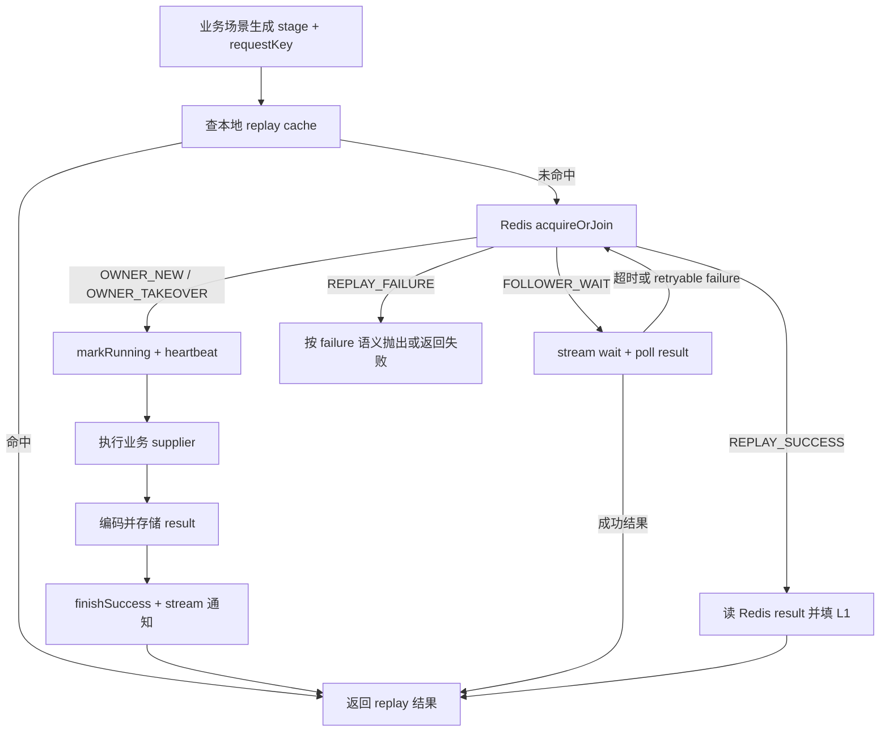

# distributed-singleflight feature design

## 0. 需求摘要

目标是在 zhiguang 引入一个可复用的分布式 single-flight 能力，用来把同一业务 key 的并发回源请求收敛为一个 owner 执行，followers 等待并复用结果。迁移来源是 AI-Meeting 的分布式 single-flight：Redis 元数据协调、owner 心跳、Redis Stream 通知、结果持久化回放、本地 L1 replay cache，以及失败可重试分类。

本轮纳入四个已经确认的业务场景：

1. `CounterServiceImpl.getCounts` 的实体计数 SDS 缺失/结构异常重建。
2. `RelationController.counter` 触发的 `UserCounterServiceImpl.rebuildAllCounters` 用户维度 SDS 重建。
3. `FollowFeedServiceImpl.readAuthorHead` 的关注 Feed 大 V 作者 head 缓存回源。
4. `ModerationReviewExecutorImpl` 的审核 LLM 调用去重。

成功标准是：同一 key 的并发请求在 owner 成功时拿到一致结果，不再因为抢不到锁而返回 0、重复打 Cassandra、跳过审核或重复请求 LLM；owner 失败时 followers 能按失败类型得到可预测的等待、接管或失败语义。

明确不做：

- 不把 AI-Meeting 的 interview / AI 命名、`ai:flight:*` Redis key、String-only 结果编码原样搬进 zhiguang。
- 不改变四个业务场景的对外 API 响应结构。
- 不在本 feature 内顺手改造 `KnowPostServiceImpl.getDetail` 的本地 single-flight；它可以替换，但需要先处理详情缓存与权限语义，见第 1 节。
- 不新增数据库 schema。

## 1. 决策与约束

**事实基线**

- AI-Meeting 的 `DistributedInterviewAiSingleFlightService` 在分布式模式下先查 L1 replay cache，再通过 `FlightCoordinatorRepository.acquireOrJoin` 取得 `OWNER_NEW` / `OWNER_TAKEOVER` / `FOLLOWER_WAIT` / `REPLAY_SUCCESS` / `REPLAY_FAILURE`，owner 执行 supplier 后存储结果、标记成功并通过 stream 通知 followers。
- `CounterServiceImpl.getCounts` 当前在 SDS 缺失时使用 `lock:sds-rebuild:{entityType}:{entityId}` Redisson lock；抢不到锁或限流/退避时直接按请求 metrics 返回 0。
- `RelationController.counter` 当前在 `ucnt:{userId}` 缺失或采样不一致时直接调用 `userCounterService.rebuildAllCounters(userId)`，没有分布式等待或结果复用。
- `FollowFeedServiceImpl.readAuthorHead` 当前用 `feed:author:{authorId}:head:lock` Redisson lock；抢不到锁时直接 `loadAuthorFeed`，会重复打 Cassandra。
- `ModerationReviewExecutorImpl.review` 当前用 `moderation:review:lock:{reportId}` Redisson lock；抢不到锁直接返回，owner 在 `doReview` 中调用 `llmClient.review(report)` 并执行数据库状态更新、内容处置、通知。
- zhiguang 现有一个本地 JVM 级 single-flight：`KnowPostServiceImpl.getDetail` 使用 `singleFlight.computeIfAbsent(pageKey, k -> new Object())` 加 `synchronized` 保护详情页回源。它不是分布式能力。

**核心决策**

1. 新能力放在公共层，建议包名 `com.tongji.common.singleflight`。它跨 counter / relation / recommendation / moderation 四个业务模块，不应归属任一业务包。
2. 迁移采用“复制模式，不复制业务外壳”的策略：保留 AI-Meeting 的协调仓储、通知、心跳、结果回放、失败分类骨架；替换 interview/AI 语义、String-only serializer、Redis key 前缀。
3. 对外接口要支持 typed result replay。AI-Meeting 只处理 `String`；本轮结果类型包括 `Map<String, Long>`、用户计数 map、`List<TimelineItem>`、`ModerationLlmResult`。设计接口必须让 caller 显式提供结果类型或 codec，禁止靠模糊 fallback 猜结构。`stage` 和 `requestKey` 为空时直接视为调用方错误，不沿用 AI-Meeting 的默认 key 兜底。
4. Redis key 统一使用 zhiguang 前缀，例如 `zg:singleflight:meta:{stage}:{hash}`、`zg:singleflight:result:{stage}:{hash}`、`zg:singleflight:stream:{stage}:{hash}`，避免和现有 `ai:flight:*` 或业务 key 冲突。
5. 现有 Redisson lock 可被替换或降级为旁路保护，但不能叠加出两套 owner 决策。四个场景中，计数、用户计数、Feed head 可以用分布式 single-flight 替换锁分支；审核场景删除“抢不到 Redisson lock 直接 return”的入口语义，single-flight 复用 LLM 结果。终态迁移继续依赖现有 `WHERE status='pending'` 更新作为 CAS；retry 调度必须把 `sourceRetryCount` 加入 `scheduleRetry` 的 CAS 条件。只有数据库更新 `updated == 1` 的调用继续后续副作用；CAS 失败者直接返回。

**关于 zhiguang 现有本地 single-flight**

`KnowPostServiceImpl.getDetail` 的本地 single-flight 可以被新的分布式 single-flight 替换，但不纳入本轮四场景主线。原因是它的 `pageKey` 只包含内容 ID 和布局版本，而回源路径包含权限判断与公共缓存写入；如果直接做分布式结果回放，可能扩大现有详情缓存/权限语义风险。后续替换前必须先明确：回放结果是“可公共缓存的基础详情”还是“带当前用户权限的最终响应”，以及私有内容是否允许进入公共缓存。

**复杂度档位**

本 feature 属于高并发基础设施迁移，复杂度高于普通业务改造：它新增跨模块公共接口、Redis Lua/Stream 协调、异常语义、并发测试与集成测试。验收不能只看单线程单测，必须覆盖 owner/follower、接管、失败回放、四个业务挂载点。

## 2. 设计

### 2.1 名词层：现状 -> 变化

**现状**

- 计数 SDS 重建、Feed author head 回源、审核 review 使用 Redisson lock 或本地锁，只做互斥，不提供跨节点结果回放。
- 用户维度计数重建没有锁，多个请求可同时执行 `rebuildAllCounters`。
- `KnowPostServiceImpl.getDetail` 的 `singleFlight` 是本地 map + synchronized，只在单 JVM 内有效。
- AI-Meeting 的结果模型是 `String`，并且 Redis key 与配置命名带 interview/AI 业务语义。

**变化**

新增公共 single-flight 名词：

- `DistributedSingleFlightService`：业务入口，接收 stage、requestKey、结果类型/codec、supplier，返回 owner 结果或 follower replay。
- `SingleFlightPolicy`：每个 stage 的运行 TTL、结果 TTL、失败 TTL、follower 最大等待、stream block、poll fallback、L1 replay cache 配置。
- `SingleFlightCoordinatorRepository`：Redis Lua 原子协调，负责 acquire/join、mark running、heartbeat、store result、finish success/failure、读取 meta/result。
- `SingleFlightNotificationService`：基于 Redis Stream 发布 owner terminal event，followers block wait 后再读 result。
- `SingleFlightHeartbeatManager`：owner 执行期间续 heartbeat，允许 owner 异常退出后被 takeover。
- `SingleFlightResultCodec`：以 Jackson JSON bytes 为默认结果编码，外层保留 codec、gzip、checksum、owner token、createdAt。业务类型必须显式传入，不能靠字段候选推断。
- `SingleFlightLocalReplayCache`：进程内短 TTL replay cache，减少同节点 followers 对 Redis result 的重复读取。

接口示例：

```java
Map<String, Long> counts = singleFlight.execute(
        "counter-sds",
        "knowpost:123:like,fav",
        new TypeReference<Map<String, Long>>() {},
        policy,
        () -> rebuildCountsFromFacts(...)
);
```

接口不承诺吞掉业务异常。owner 失败后按异常分类写入 FAILED meta；followers 读取非 retryable failure 时得到同类失败语义，retryable failure 可在等待超时或 takeover 后重试。

### 2.2 编排层：现状 -> 变化

**现状**

四个业务场景各自处理并发：

- 计数 SDS：抢不到 lock 返回 0。
- 用户计数：直接重建，缺失时二次读取，仍失败返回 0。
- Feed author head：抢不到 lock 直接 Cassandra 回源。
- 审核 LLM：抢不到 lock 直接返回；owner 会调用 LLM 并写数据库副作用。

**变化**

主流程：



四个挂载点的业务语义：

- `counter-sds`：key 由 `entityType + entityId + metrics` 组成；owner 负责按事实重建请求 metrics、写 SDS、删除 agg fields、reset backoff；followers 返回同一 map。成功后不再走“抢不到锁返回 0”。
- `user-counter`：key 为 `userId`；owner 调用新增的唯一 adapter `UserCounterRebuildAdapter.rebuildAndRead(userId): Map<String, Long>`。adapter 内部先复用现有 `UserCounterService.rebuildAllCounters(userId)` 写入 `ucnt:{userId}`，再按 `RelationController.counter` 当前 5 段读取规则组装 map；followers replay 该 map。`rebuildAllCounters` 现有 `void` 签名不被假设成返回值。
- `feed-author-head`：只保护 `cursor == null` 的 head cache miss；key 为 `authorId + safeLimit`。owner Cassandra 回源并写 `feed:author:{authorId}:head`；followers replay 同一 list。带 cursor 的分页回源不纳入，避免把不同页混成同一个 replay。
- `moderation-llm`：key 固定为 `report:{reportId}:retry:{retryCount}`，其中 `retryCount` 的唯一来源是 `review(reportId)` 调用开始后 `reportMapper.findById(reportId)` 读取到的 pending report；空值按当前代码语义视为 0。single-flight 只包裹 `llmClient.review(report)` 的外部调用结果。所有竞争者拿到同一 `ModerationLlmResult` 后都进入同一个结果处理函数，但数据库副作用必须受 CAS 保护：
  - `markReviewed` / `markIgnored` 继续使用现有 `WHERE status='pending'`，只有 `updated == 1` 后才允许 `applyApprovedAction` 和 `notifyReportProcessed`。
  - `scheduleRetry` 增加 `sourceRetryCount` 入参，SQL 条件收紧为 `WHERE id = ? AND status = 'pending' AND retry_count = sourceRetryCount`；只有 `updated == 1` 表示本次 retry 调度成功，其他竞争者直接返回。

错误语义：

- owner 进程存活但 supplier 未结束：followers 等 stream 事件并按 poll fallback 读取 result。
- owner heartbeat 过期：后续请求可 takeover。
- owner 成功但 follower 错过 stream：poll result 仍可成功。
- retryable failure：短失败 TTL，允许后续 takeover 或业务 retry。
- non-retryable failure：followers 不重复执行 supplier，读取失败语义。

### 2.3 挂载点

1. `counter-sds`：实体计数 SDS 缺失/异常重建入口。删除这个挂载点后，抢锁失败返回 0 的旧行为会回来。
2. `user-counter`：用户维度 SDS 缺失或采样不一致重建入口。删除这个挂载点后，多个请求仍可同时执行全量用户计数重建。
3. `feed-author-head`：关注 Feed 作者 head 首屏缓存 miss 回源入口。删除这个挂载点后，抢不到锁仍会并发 Cassandra 回源。
4. `moderation-llm`：审核 LLM 调用去重入口。删除这个挂载点后，重复 consumer/retry 竞争时无法复用同一审核模型结果。

`KnowPostServiceImpl.getDetail` 的本地 single-flight 是可替换候选，不列入本节挂载点；删除它不会影响本 feature 是否存在。

### 2.4 推进策略

1. 建立公共 single-flight 骨架：复制 AI-Meeting 的协调、通知、心跳、L1 replay、结果校验模型，改名为 zhiguang 公共语义并接入 typed codec。退出信号：公共服务可在测试中模拟 owner/follower 成功 replay。
2. 接入实体计数 SDS 与用户计数 SDS：先覆盖返回 map 的两个计数场景，保留原有重建写 SDS 的事实逻辑。退出信号：并发缺失场景只触发一次事实重建，followers 返回 owner 结果。
3. 接入 Feed author head：只覆盖 `cursor == null` 的 head cache miss，cursor 分页保持现状。退出信号：并发 head miss 只触发一次 Cassandra `authorRead`，followers 返回同一列表。
4. 接入审核 LLM：用 single-flight 复用 `ModerationLlmResult`，并用 pending 状态 CAS / retryCount CAS 保证终态迁移、retry 调度、内容处置、通知最多执行一次。退出信号：并发同一 report/retryCount 审核只调用一次 LLM，只有一次数据库终态迁移或 retry 调度，通知路径最多执行一次。
5. 完成配置、观测与回滚开关：按 stage 配置 TTL/等待时长/模式，至少支持 disabled/local/distributed/hybrid。退出信号：关闭开关后四个场景回到原有行为边界。
6. 完成并发测试、业务集成测试与必要的 Maven 验证。退出信号：公共 single-flight、四个业务挂载点、已有相关测试全部通过。

Top 3 风险与缓解：

- 泛型结果编码错误会让 followers 反序列化失败。缓解：接口强制传 `TypeReference` 或 codec；公共测试覆盖 `Map<String, Long>`、`List<TimelineItem>`、`ModerationLlmResult`。
- 审核场景如果把副作用也回放给 followers，会重复更新、调度 retry 或通知。缓解：只复用 LLM 结果，review 终态迁移由现有 `WHERE status='pending'` CAS 保证单执行，retry 调度由新增 `retry_count = sourceRetryCount` CAS 保证单执行，内容处置和通知只允许 `updated == 1` 后继续。
- TTL/heartbeat 过短会造成 owner 未结束就被 takeover，过长会放大等待。缓解：stage policy 显式配置，测试覆盖 heartbeat 续租和 takeover。

必要依赖：

- Redis 字符串、Lua、Stream 能力。
- 已有 Redisson / `StringRedisTemplate`。
- Jackson 对业务结果类型的序列化能力。

必跑验证命令：

- `mvn test` 使用项目当前 Maven/JDK 基线。
- 针对公共 single-flight 与四个挂载点的定向测试命令，具体 test class 由实现阶段命名。

### 2.5 结构健康度与微重构

文件级评估：

- `CounterServiceImpl` 已经同时包含 toggle、SDS 读写、重建、退避、限流逻辑；本 feature 不在该文件内继续堆协调细节，只在缺失分支调用公共 single-flight。
- `RelationController` 当前包含用户计数读取、采样校验与重建触发；本 feature 不扩大 controller 职责，必要时把重建后读取 map 的编排收敛到用户计数服务。
- `FollowFeedServiceImpl` 的 `TimelineItem` 是同文件私有 record，已有 JSON cache 读写；本 feature 不把它提升成公共 DTO，typed codec 可以在同文件调用边界内处理。
- `ModerationReviewExecutorImpl` 已经包含 LLM 结果判定、数据库终态迁移、内容动作和通知；本 feature 只切入 LLM 调用去重，不重排审核状态机。

目录级评估：

- `src/main/java/com/tongji/common` 已存在，适合作为跨业务公共能力入口。
- `.codestable/compound` 当前没有命中目录组织或命名约定的沉淀，本次只在 design 中给出建议，不直接沉淀 convention。

结论：本轮不做独立微重构。原因是主要结构风险来自新增公共基础设施，而不是既有文件命名或目录混乱；把 single-flight 细节放入 `com.tongji.common.singleflight` 后，业务文件只承担挂载调用，收益高于先拆旧文件。

超出范围的观察：

- `KnowPostServiceImpl.getDetail` 的本地 single-flight 可作为后续 feature 替换，但必须先澄清详情缓存权限语义。
- `CounterServiceImpl.bitCountShardsPipelined` 当前使用 `redis.keys(pattern)`，这是性能风险；它不是 single-flight 迁移的前置条件，后续可单独走性能优化。

## 3. 验收契约

### Acceptance Coverage Matrix

| 场景 | 输入 / 触发 | 期望可观测结果 | 证据类型 |
|---|---|---|---|
| 实体计数 SDS 并发缺失 | 同一 `entityType/entityId/metrics` 多线程同时调用 `getCounts`，Redis SDS 不存在 | 事实重建 supplier 只执行一次；所有成功请求返回同一 map；不出现抢锁失败返回 0 | 单测 / 集成测试 / mock invocation count |
| 用户计数 SDS 并发缺失 | 同一 `userId` 多请求同时触发 `RelationController.counter` | `rebuildAllCounters` 只执行一次；followers 返回重建后的 5 个指标 | 单测 / controller 集成测试 |
| 用户计数采样不一致 | `ucnt:{userId}` 存在但关注/粉丝段与 DB 计数不一致 | 只触发一次全量重建；最终返回重建后的 SDS 值 | 单测 / mapper invocation count |
| Feed author head 并发 miss | 多请求读取同一 `authorId`、`cursor == null`、相同 `safeLimit`，head cache 不存在 | Cassandra author head 查询只执行一次；Redis head cache 被写入；followers 返回同一列表 | 单测 / 集成测试 |
| Feed cursor 分页 | `cursor != null` | 不使用 `feed-author-head` single-flight key；分页结果仍按 cursor 查询 | 单测 |
| 审核 LLM 并发终态 review | 同一 pending `reportId`、同一 `retryCount` 被 consumer 和 retry job 同时 review，LLM 返回 approved/rejected/ignored 类终态结果 | 外部 LLM client 只调用一次；只有一个终态迁移成功；内容动作与通知最多执行一次；抢不到旧 Redisson lock 不再直接 return | 单测 / mapper CAS 断言 |
| 审核 LLM 并发 retryable 结果 | 同一 pending `reportId`、同一 `retryCount` 被并发 review，LLM 返回 `retryableFailure()` | 外部 LLM client 只调用一次；`scheduleRetry` 只有一次 `retry_count = sourceRetryCount` CAS 成功；其他竞争者直接返回 | 单测 / mapper CAS 断言 |
| owner retryable failure | supplier 抛出 timeout / provider overload 类 retryable 异常 | 写入 retryable FAILED meta；后续请求可重试或 takeover；followers 不拿到伪成功结果 | 公共 single-flight 单测 |
| owner non-retryable failure | supplier 抛出 validation 类 non-retryable 异常 | followers 读取失败语义，不重复执行 supplier | 公共 single-flight 单测 |
| owner heartbeat 过期 | owner mark running 后停止 heartbeat | 后续请求可 takeover 并完成结果 | 公共 single-flight 集成测试 |
| 回滚开关 | stage disabled 或全局 disabled | 业务走原有本地/直接执行路径，single-flight Redis key 不新增 | 配置测试 / 单测 |

### DoD Contract

- Design DoD：本 design、checklist、design-review 三份文件落盘；checklist YAML 可解析。
- Implementation DoD：公共 single-flight 能力和四个挂载点完成；不遗留旧锁失败返回 0 / 直接 Cassandra 回源 / 重复 LLM 调用的受保护路径。
- Review DoD：code review 重点复核 Redis key 命名、typed codec、owner/follower 错误语义、审核 `reportId + retryCount` key、pending CAS 与 retryCount CAS 单执行。
- QA DoD：公共并发测试、四个业务集成测试、Maven 定向测试和必要全量测试通过。
- Acceptance DoD：验收矩阵每一项都有测试或命令证据；关闭开关可回滚。

## 4. 回滚、交付物与后续

回滚方式：

- 全局关闭 `singleflight.enabled` 或按 stage 关闭，业务回到原有路径。
- 删除四个业务挂载调用后，公共模块可保留但不生效。
- Redis 中 `zg:singleflight:*` key 均带 TTL，不需要数据库回滚。

交付物：

- 公共 single-flight Java 包与配置属性。
- 四个业务挂载点的代码改动。
- 公共并发测试与四个业务场景测试。
- 必要配置示例和默认 policy。

后续建议：

- 单独评审 `KnowPostServiceImpl.getDetail` 本地 single-flight 替换，先修正或确认详情缓存权限语义。
- 若实体计数重建仍成为热点，再单独优化 `redis.keys(pattern)` 分片枚举策略。
