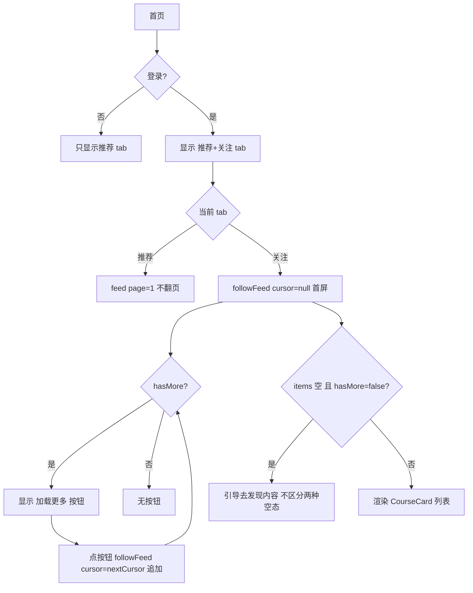

# 前端关注 Feed 设计

## 0. 需求摘要与决策

- **用户目标**：登录用户能在首页看关注的人的帖子，不用进每个人主页。
- **核心行为**：首页顶部"推荐/关注"tab 切换；关注 tab 调 follow feed（cursor 翻页 + "加载更多"按钮）；空态引导去发现内容。
- **成功标准**：登录用户切关注 tab 看到关注作者的帖子；点"加载更多"追加下一页；没关注人/关注人没发帖时显示引导。
- **明确不做**（grep / 测试可反向核对）：
  - 推荐 tab 不加翻页（保持现状只加载第 1 页）
  - 不做"关注的人"列表页（只做 feed）
  - 不改后端（后端 git diff 为空）
  - 不做新页面/新路由（只改 HomePage + service）
  - 不做无限滚动（用"加载更多"按钮，复用仓库现有模式）
  - 不区分"没关注人"vs"关注了但没发帖"两种空态（统一引导，接受体验瑕疵）
- **复杂度档位**：默认（单页面加 tab + 1 service 方法，无跨模块）。
- **关键决策**（owner 已拍板 + review 修订）：
  - D1 顶部 tab 切换（推荐/关注），默认推荐 tab
  - D2 只关注 tab 翻页（"加载更多"按钮 + cursor），推荐 tab 保持现状；复用 CommentSection 现有 loadMore 模式，不引入无限滚动
  - D3 空态引导去发现内容（跳搜索/推荐），不区分两种空态
  - D4 未登录只显示推荐 tab（follow feed 需鉴权，隐藏关注 tab）

## 1. 决策与约束、风险与证据

### 1.1 结构归属

前端 `zhiguang_fe`。service 层加 `followFeed` 方法（cursor 翻页）；HomePage 加 tab 切换 + 关注 tab 加载更多按钮 + 空态。后端零改动。

### 1.2 Top 3 风险

- **R1（最可能实现偏）**：follow feed 是 cursor 游标，公开 feed 是 page/size——两套分页逻辑混在 HomePage 易错。缓解：关注 tab 独立 state（items/nextCursor/loading），与推荐 tab state 隔离。
- **R2（最易验收遗漏）**：未登录隐藏关注 tab 的边界。缓解：design S6 + grep 确认未登录无关注 tab。
- **R3（最易回归）**：tab 切换时不清旧 state → 切回推荐 tab 残留关注数据。缓解：tab 切换重置 state 或各 tab 独立 state。

### 1.3 非显然依赖

- follow feed 需鉴权 token（`@AuthenticationPrincipal Jwt`），未登录调必 401 → D4 隐藏 tab
- cursor 由后端 `nextCursor` 原样回传（string，格式不透明，前端不解析）
- `FeedResponse` 类型缺 `nextCursor` 字段（后端返回了，前端类型要补）

### 1.4 关键假设

- **已验证事实**（读 `KnowPostController.followFeed` 确认）：
  - follow feed 接口 `GET /knowposts/feed/follow?cursor=X`，返回 `FeedPageResponse {items, page, size, hasMore, nextCursor}`
  - cursor 是不透明 string（内部 `时间戳:contentId`），前端原样回传
  - 每页大小 `FOLLOW_FEED_SIZE` 后端定，前端不传 size
  - `hasMore=true` 时 `nextCursor` 非空，`hasMore=false` 时 nextCursor=null
- 假设：登录用户切关注 tab 时 `tokens.accessToken` 已可用——**HomePage 需新引入 `useAuth()` 取 `tokens`**（现状 HomePage 无 useAuth，是新增依赖，见 1.6 交付物）。

### 1.5 必跑验证命令与基线风险

- 前端 `npm run lint`（基线应绿）
- 后端 `mvn spring-boot:run`（8080）+ curl follow feed 带 token
- 浏览器肉眼验证 tab 切换 + 加载更多按钮 + 空态
- **基线风险**：无（首页现状可跑，follow feed 接口已 ready）

### 1.6 交付物清单

- 修改：`services/knowpostService.ts`（加 followFeed 方法）
- 修改：`types/knowpost.ts`（FeedResponse 补 nextCursor 字段）
- 修改：`pages/HomePage.tsx`（引入 useAuth + tab 切换 + 关注 tab 加载更多 + 空态 + 未登录隐藏）
- 无后端改动、无新路由、无新组件文件

### 1.7 清洁度规则

- 禁 `console.log` / TODO / FIXME / 注释代码 / 死 import

## 2. 名词层与编排层

### 2.1 名词层

**现状**（`knowpostService.ts:86-87`）：
```ts
feed: (page = 1, size = 20) => apiFetch<FeedResponse>(`${PREFIX}/feed?page=${page}&size=${size}`)
// 无 followFeed；FeedResponse 缺 nextCursor 字段
```

**变化**：
```ts
// FeedResponse 补 nextCursor（后端已返回，前端类型补齐）
// 注：followFeed 返回的 page 恒 1、size 恒 FOLLOW_FEED_SIZE 是后端占位，关注 tab 只用 items/hasMore/nextCursor
export type FeedResponse = { items: FeedItem[]; page: number; size: number; hasMore: boolean; nextCursor?: string };

// followFeed：cursor 游标翻页，需 token。用 URLSearchParams 构建 query（仓库惯例，: 不需编码——是合法 sub-delim）
followFeed: (cursor: string | null, accessToken: string) => {
  const usp = new URLSearchParams();
  if (cursor) usp.set("cursor", cursor);
  const qs = usp.toString();
  return apiFetch<FeedResponse>(`${PREFIX}/feed/follow${qs ? `?${qs}` : ""}`, { accessToken });
}
```

### 2.2 编排层



**现状 → 变化**：
- 现状（`HomePage.tsx`）：单 feed，`feed(1,20)` 无翻页，无 tab，无 useAuth
- 变化：引入 `useAuth()` 取 tokens；tab 切换（推荐/关注）；关注 tab 用"加载更多"按钮（复用 CommentSection:277 loadMore 模式，不引入无限滚动）；空态引导

**流程级约束**：
- **state 隔离（R3）**：关注 tab state（items/nextCursor/loading/hasMore/error）在 HomePage 顶层 useState 持有，tab 切换只切渲染分支不 unmount → 切回关注 tab 数据仍在（S4）。渲染用三目/早返回 `{tab==='follow' ? <关注视图/> : <推荐视图/>}`，**不用 `{cond && <Comp/>}`**（避免子组件 unmount 丢 state）
- **首屏 fetch 触发时机**：关注 tab 首屏 fetch 只在"首次切到关注 tab"时跑（用 hasFetched ref 标志），切走再切回不重 fetch（保留已加载 items，避免覆盖 + 闪烁）
- **翻页（B1）**：用"加载更多"按钮（hasMore=true 时显示），复用 CommentSection 现有模式；不引入 IntersectionObserver/scroll 监听（仓库无此模式）。loading 标志防重复点击
- **cursor 回传**：cursor 原样回传（URLSearchParams 构建，`:` 不需编码——合法 sub-delim，Spring 能解析）
- **取消**：useEffect cleanup 用 cancelled 标志（沿用现有模式）
- **未登录（D4）**：`tokens?.accessToken` falsy 时不渲染关注 tab
- **错误态（S1）**：复用 HomePage error state；翻页中途失败保留已加载 items + 显示 error 提示（不清空）
- **空态（I2）**：不区分"没关注人"vs"关注了但没发帖"，统一"去发现内容"引导（接受体验瑕疵）

### 2.3 挂载点清单（删了它 feature 是否消失）

- M1 HomePage tab 切换 UI（推荐/关注）——删 → 回到单 feed
- M2 `knowpostService.followFeed` 方法——删 → 无关注接口
- M3 关注 tab "加载更多"按钮逻辑（cursor + loadMore）——删 → 无翻页
- M4 关注 tab 空态引导——删 → 无引导

反向核对：grep `followFeed` 落点在 M2+M3，grep tab 切换在 M1。

### 2.4 推进策略（paradigm 切片）

- **step1 service + types**：FeedResponse 补 nextCursor + 加 followFeed 方法（URLSearchParams 构建 query）。`exit_signal`：lint 绿 + curl follow feed 带 token 返回 200 + items。
- **step2 HomePage tab + 关注 tab 首屏 + 空态 + 未登录隐藏**：引入 useAuth + tab 切换 UI + 关注 tab 首屏加载（state 顶层持有）+ 空态引导（不区分）+ 未登录隐藏关注 tab。`exit_signal`：lint 绿 + 浏览器登录后切关注 tab 看到关注作者帖子（或空态引导）；未登录无关注 tab。
- **step3 加载更多按钮 + harden**：hasMore=true 显示"加载更多"按钮（复用 CommentSection 模式）+ 防重复 + tab 切换不 unmount（state 隔离）+ 错误态 + 清洁度。`exit_signal`：浏览器点加载更多追加（有 hasMore 时）+ tab 切换不残留 + grep 清洁。

### 2.5 结构健康度与微重构

评估前查 compound：无目录组织 convention。

- **文件级**：`HomePage.tsx` 94 行，本次加 tab + 加载更多按钮约 +80 行，到 ~170 行。仍单文件可接受（tab 逻辑内聚）。结论：**不做微重构**——若后续 feed 相关逻辑继续膨胀再拆 `useFollowFeed` hook（与 usePublishStatus 同模式），本次不拆。
- **目录级**：无新文件，不涉及目录 convention。
- **超出范围的观察**：HomePage 单文件含两套 feed 逻辑，建议后续走 `cs-refactor` 抽 hook。不阻塞本 feature。

## 3. 验收契约

- **S1 关注 tab 显示关注作者的帖子**：登录用户切关注 tab → follow feed 返回关注作者的帖子 → CourseCard 渲染。证据：浏览器
- **S2 加载更多按钮**：关注 tab hasMore=true 时显示"加载更多"按钮 → 点击追加下一页 → hasMore=false 时按钮消失。证据：浏览器
- **S3 空态引导（不区分两种空态）**：关注 feed 空（没关注人 OR 关注了但没发帖，前端不区分）→ 显示"去发现内容"引导。证据：浏览器（新号无关注触发）
- **S4 tab 切换不残留**：关注 tab 加载后切推荐 tab → 推荐显示公开 feed；切回关注 tab → 关注数据仍在（state 顶层持有不 unmount）。证据：浏览器
- **S5 推荐 tab 不变**：推荐 tab 仍 `feed(1,20)` 无翻页（现状不变）。证据：浏览器 + grep
- **S6 未登录无关注 tab**：未登录只显示推荐 tab，无关注 tab。证据：浏览器
- **S7 cursor 正确回传**：点加载更多时 Network 请求的 cursor 参数值 = 上次响应的 nextCursor（原样回传）。证据：浏览器 Network
- **反向核对（明确不做）**：grep 推荐 tab 无 cursor/loadMore 逻辑；无 IntersectionObserver/scroll 监听（不做无限滚动）；无新路由；后端 git diff 为空

### Acceptance Coverage Matrix

| 场景 | step | 证据类型 | 命令 / 动作 |
|---|---|---|---|
| S1 关注 tab 显示 | 2 | 浏览器 | 登录切关注 tab |
| S2 加载更多按钮 | 3 | 浏览器 | 点加载更多 |
| S3 空态引导 | 2 | 浏览器 | 新号无关注 |
| S4 tab 不残留 | 3 | 浏览器 | 切换 tab |
| S5 推荐 tab 不变 | 2 | 浏览器 + grep | 推荐 tab 无翻页 |
| S6 未登录无关注 tab | 2 | 浏览器 | 未登录看 |
| S7 cursor 回传 | 3 | 浏览器 Network | cursor 值与 nextCursor 一致 |

### DoD Contract

- Design DoD：名词层 / 编排层 / 挂载点 / 验收契约 / steps 全填，本文件 approved
- Implementation DoD：3 step 全 done
- Review DoD：`cs-code-review` passed
- QA DoD：`cs-feat-qa` passed
- Acceptance DoD：7 节核对 + 最终审计
- Validation Commands：`npm run lint`、curl follow feed、浏览器
- Required Artifacts：knowpostService.ts、types/knowpost.ts、HomePage.tsx、design.md、checklist.yaml

## 4. 后续衔接

- **attention 候选**：无（cursor 翻页用 URLSearchParams 是仓库惯例，无需额外约定；I1 已无遗留约定可沉淀）
- **compound 候选**：无（与 usePublishStatus hook 模式类似的 useFollowFeed 抽 hook 是后续 refactor 事）
- **遗留**：HomePage 重构（2.5 超出范围）；推荐 tab 翻页（明确不做）
