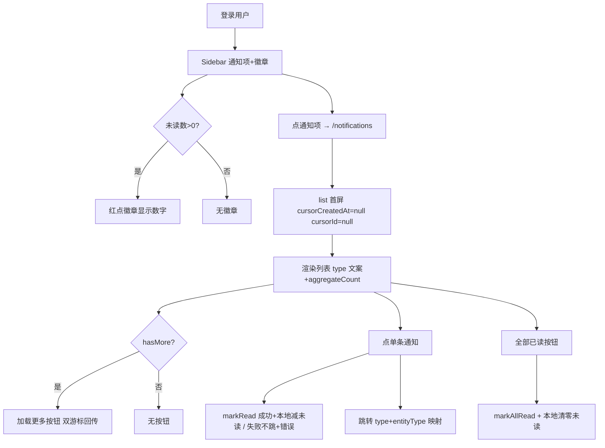

# 前端通知模块 设计

## 0. 需求摘要与决策

- **用户目标**：登录用户能查看通知（赞/评论/关注），知道有谁互动了。
- **核心行为**：Sidebar 加"通知"导航项 + 未读徽章；通知中心页列表（双游标分页 + 加载更多）；点单条标记已读 + 跳转；"全部已读"按钮。
- **成功标准**：登录用户 Sidebar 看到通知项 + 未读数；点进通知页看列表；点通知跳对应详情；未读数实时减。
- **明确不做**（grep / 测试可反向核对）：
  - 不显示 actor 昵称（后端 list 不带，不额外查接口）——只显示 type 文案 + aggregateCount
  - 不做 WebSocket 实时推送（轮询/进入页拉取）
  - 不改后端（后端 git diff 为空）
  - 不做通知设置/免打扰
- **复杂度档位**：默认（通知页 + Sidebar 徽章 + service，无跨模块）。
- **关键决策**（owner 已拍板）：
  - D1 不显示 actor 名字（只 type 文案 + aggregateCount，如"3 人赞了你的文章"）
  - D2 Sidebar 加"通知"导航项 + 未读红点徽章
  - D3 点单条通知调 markRead + 跳转；"全部已读"按钮调 markAllRead

## 1. 决策与约束、风险与证据

### 1.1 结构归属

前端 `zhiguang_fe`。service 层加 `notificationService`（4 方法）；types 加通知类型；新建通知页 `src/pages/NotificationPage.tsx`；Sidebar 加通知项 + 徽章组件。后端零改动。

### 1.2 Top 3 风险

- **R1（最可能实现偏）**：双游标分页（cursorCreatedAt + cursorId）与单 cursor 不同——两个值都要回传。缓解：service 同时传两个 query param，类型明确。
- **R2（最易验收遗漏）**：未登录无通知项。缓解：Sidebar 通知项 isLoggedIn 才渲染。
- **R3（最易回归）**：标记已读后徽章数不刷新。缓解：markRead/markAllRead 成功后本地减未读数 + 刷新徽章。

### 1.3 非显然依赖

- 通知接口需鉴权（`@AuthenticationPrincipal Jwt`），未登录 401 → Sidebar 通知项隐藏
- id（notificationId）是 snowflake Long，前端 string 化防精度丢失（对齐评论 id string 约定，见 compound `counter-likecount-read-sds-not-mysql.md` 的 `[[snowflake-id-serialize-as-string]]`）
- 双游标：`cursorCreatedAt`（ISO DateTime）+ `cursorId`（Long），两个都要回传

### 1.4 关键假设

- **已验证事实**（读 `NotificationController` + DTO 确认）：
  - list `GET /notifications?cursorCreatedAt=&cursorId=&limit=` → `NotificationPageResponse {items, nextCursorCreatedAt, nextCursorId, hasMore}`
  - `NotificationItemResponse`：id/type/isRead/createdAt/actorUserId/entityType/entityId/secondEntityType/secondEntityId/aggregateCount/windowStart/windowEnd
  - unread-count `GET /notifications/unread-count` → `{unreadCount: int}`
  - markRead `POST /notifications/{id}/read` → 204
  - markAllRead `POST /notifications/read-all` → 204
  - type ∈ {like, comment, follow, moderation_action, report_processed}
- 假设：通知列表项的 actorUserId 不显示（D1），所以不需要查用户信息
- 跳转映射（基于 type + entityType 二元组，见 2.2 流程级约束）：
  - like + knowpost → /post/{entityId}；like + comment → 不跳（entityId 是 commentId，D1 不反查）
  - comment → /post/{entityId}（entityId=postId，secondEntityId=commentId 不用于跳转）
  - follow → /profile（自己主页，D1 不显示 actor + 无他人主页路由）

### 1.5 必跑验证命令与基线风险

- 前端 `npm run lint`（基线应绿）
- 后端 `mvn spring-boot:run`（8080）+ curl 通知接口带 token
- 浏览器肉眼验证徽章 + 列表 + 跳转
- **基线风险**：无（通知接口已 ready）

### 1.6 交付物清单

- 新增：`services/notificationService.ts`
- 新增：`types/notification.ts`
- 新增：`pages/NotificationPage.tsx` + `.module.css`
- 新增：`components/common/NotificationBadge.tsx`（Sidebar 徽章）
- 修改：`components/layout/Sidebar.tsx`（加通知项 + 徽章 + **引入 useAuth** 取 tokens 判登录态）
- 修改：`App.tsx`（加 /notifications 路由）
- 无后端改动

### 1.7 清洁度规则

- 禁 `console.log` / TODO / FIXME / 注释代码 / 死 import

## 2. 名词层与编排层

### 2.1 名词层

**现状**：无通知相关 service/types/页面（grep 确认）。

**变化**：
```ts
// types/notification.ts
export type NotificationType = "like" | "comment" | "follow" | "moderation_action" | "report_processed";
export type NotificationItem = {
  id: string;  // snowflake Long → string 防精度
  type: NotificationType;
  isRead: boolean;
  createdAt: string;
  actorUserId: string;
  entityType: string | null;
  entityId: string | null;
  secondEntityType: string | null;
  secondEntityId: string | null;
  aggregateCount: number;
  windowStart: string | null;  // 对齐后端契约，当前不渲染
  windowEnd: string | null;
};
export type NotificationPage = {
  items: NotificationItem[];
  nextCursorCreatedAt: string | null;
  nextCursorId: string | null;
  hasMore: boolean;
};
export type NotificationUnreadCount = { unreadCount: number };

// services/notificationService.ts
list(cursorCreatedAt, cursorId, limit, accessToken) → NotificationPage  // 双游标
unreadCount(accessToken) → NotificationUnreadCount
markRead(id, accessToken) → void  // POST /{id}/read
markAllRead(accessToken) → void   // POST /read-all
```

### 2.2 编排层



**流程级约束**：
- 双游标分页：`cursorCreatedAt` + `cursorId` 两个值**成对**回传（都传或都不传，禁止只传一个——后端 `<if test="cursorCreatedAt != null and cursorId != null">` 要求同时非 null），URLSearchParams
- 标记已读（独立于跳转）：点单条调 markRead，**成功后**本地 `isRead=true` + 徽章数 -1（无论是否跳转）；**失败时**显示错误，通知保持未读。"全部已读"调 markAllRead，成功后本地全 isRead + 徽章 0
- 跳转映射（基于 type + entityType 二元组，与标记已读解耦——标记成功就生效，跳转与否看映射）：
  - `like` + entityType="knowpost" → `/post/{entityId}`
  - `like` + entityType="comment" → **不跳**（赞的是评论，entityId 是 commentId，D1 不做反查 postId）
  - `comment` → `/post/{entityId}`（entityId=postId，secondEntityId 是 commentId 不用于跳转）
  - `follow` → `/profile`（跳自己主页，D1 不显示 actor + 无他人主页路由）
  - 其它（moderation_action/report_processed 或未知）→ 不跳
- 文案映射（D1 不显示 actor，按 type+entityType）：`like`+knowpost→"赞了你的文章"，`like`+comment→"赞了你的评论"，`comment`→"评论了你的文章"，`follow`→"关注了你"；aggregateCount=1 无前缀（"赞了你的文章"），>1 前缀"{n} 人"（"3 人赞了你的文章"）
- 徽章未读数两时机拉取：(a) Sidebar 挂载且已登录时（useEffect 依赖 tokens.accessToken），(b) 进 NotificationPage 时；markRead/markAllRead 成功后本地同步减
- 未登录：Sidebar 通知项不渲染（D2 + isLoggedIn）
- id string 化：notificationId 全程 string
- markRead 后端 UPDATE 幂等，前端点击即标记无需防重

### 2.3 挂载点清单（删了它 feature 是否消失）

- M1 Sidebar 通知项 + NotificationBadge 组件——删 → 无通知入口
- M2 notificationService 4 方法——删 → 无接口
- M3 NotificationPage 通知中心页——删 → 无列表页
- M4 /notifications 路由——删 → 无路由

反向核对：grep `notificationService` / `NotificationBadge` / `NotificationPage` 落点都在清单内。

### 2.4 推进策略（paradigm 切片）

- **step1 service + types**：notificationService（4 方法）+ types/notification。`exit_signal`：lint 绿 + curl list 带 token 返回 200 + items。
- **step2 NotificationPage 列表 + 文案 + 跳转**：通知中心页（双游标加载更多 + type 文案 + aggregateCount + 点单条跳转）。`exit_signal`：lint 绿 + 浏览器登录后进通知页看到列表（或空态）。
- **step3 Sidebar 徽章 + 标记已读 + harden**：Sidebar 通知项 + NotificationBadge（未读数）+ markRead/markAllRead + 本地未读同步 + 清洁度。`exit_signal`：浏览器徽章显示未读数 + 点通知标记已读徽章减 + 全部已读徽章清零 + grep 清洁。

### 2.5 结构健康度与微重构

评估前查 compound：无目录组织 convention。

- **文件级**：Sidebar.tsx 现状 ~30 行，本次加通知项 + 徽章 + 引入 useAuth + 未读数 state/effect，约 +30 行到 ~60 行，可接受。NotificationPage 新建单文件。结论：**不做微重构**。
- **目录级**：pages/ 已有多页，新增 NotificationPage 符合现有结构。components/common/ 已有徽章类组件先例（RelationCounters）。无 convention 候选。
- **超出范围的观察**：无。

## 3. 验收契约

- **S1 Sidebar 通知项 + 徽章**：登录用户 Sidebar 看到"通知"项；有未读时显示红点数字。证据：浏览器
- **S2 通知列表显示**：进 /notifications 看到通知列表（type 文案 + aggregateCount）。文案按 type+entityType（like+knowpost→"赞了你的文章"，like+comment→"赞了你的评论"）；aggregateCount=1 无前缀，>1 前缀"{n} 人"。证据：浏览器
- **S3 双游标加载更多**：hasMore=true 显示"加载更多"按钮 → 点击追加（cursorCreatedAt + cursorId 成对回传）。证据：浏览器 Network
- **S4 点通知跳转 + 标记已读**：点单条 → markRead 成功后本地 isRead=true + 徽章 -1（无论是否跳转）；跳转按 type+entityType（like+knowpost→/post/{entityId}，like+comment→不跳但仍标记已读，comment→/post/{entityId}，follow→/profile）；markRead 失败不跳 + 显示错误 + 通知保持未读。证据：浏览器 Network
- **S5 全部已读**：点"全部已读"按钮 → markAllRead + 列表全 isRead + 徽章 0。证据：浏览器
- **S6 未登录无通知项**：未登录 Sidebar 无通知项。证据：浏览器
- **S7 id string 精度**：notificationId 在前端全程 string（Network 请求 path 用 string，无精度丢失）。证据：浏览器 Network
- **S8 空态**：无通知时显示"暂无通知"。证据：浏览器
- **反向核对（明确不做）**：grep 无 actor 昵称查询逻辑；无 WebSocket；后端 git diff 为空

### Acceptance Coverage Matrix

| 场景 | step | 证据类型 | 命令 / 动作 |
|---|---|---|---|
| S1 徽章 | 3 | 浏览器 | 登录看 Sidebar |
| S2 列表 | 2 | 浏览器 | 进通知页 |
| S3 加载更多 | 2 | 浏览器 Network | 点加载更多看双游标 |
| S4 点通知 | 3 | 浏览器 Network | 点通知看 markRead+跳转 |
| S5 全部已读 | 3 | 浏览器 | 点全部已读 |
| S6 未登录无项 | 3 | 浏览器 | 未登录看 Sidebar |
| S7 id string | 2 | 浏览器 Network | notificationId 是 string |
| S8 空态 | 2 | 浏览器 | 新号无通知看空态 |

### DoD Contract

- Design DoD：名词层 / 编排层 / 挂载点 / 验收契约 / steps 全填，本文件 approved
- Implementation DoD：3 step 全 done
- Review DoD：`cs-code-review` passed
- QA DoD：`cs-feat-qa` passed
- Acceptance DoD：8 节核对 + 最终审计
- Validation Commands：`npm run lint`、curl 通知接口、浏览器
- Required Artifacts：notificationService.ts、types/notification.ts、NotificationPage.tsx、NotificationBadge.tsx、Sidebar.tsx、App.tsx、design.md、checklist.yaml

## 4. 后续衔接

- **attention 候选**：双游标分页约定（cursorCreatedAt + cursorId 两值回传）—— 候选 cs-note
- **compound 候选**：无
- **遗留**：actor 昵称显示（D1 不做，后续若要需加后端批量查接口）；WebSocket 实时推送（明确不做）；follow 通知跳转目标是自己主页（D1 不显示 actor + 无他人主页路由，后续加他人主页路由可改跳 /profile/{actorUserId}）；like+comment 通知不跳转（D1 不反查 postId，后续可加评论→帖子查询）
