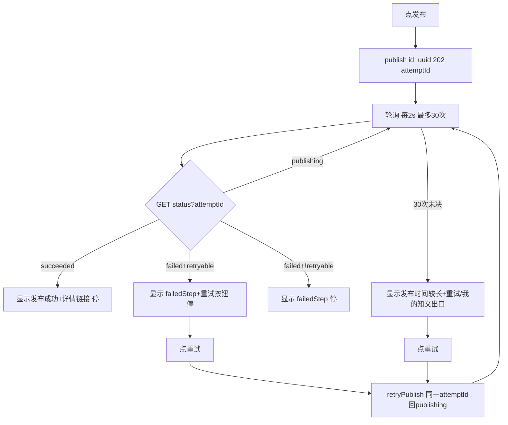

# 前端发布状态 + 重试 设计

## 0. 需求摘要与决策

- **用户目标**：发布知文后真实反映发布结果（成功 / 失败可重试），不再"假成功"。
- **核心行为**：点发布 → 202 拿 `attemptId` → 轮询 `publish/status`（每 2s，60s 上限）→ success 显示成功 / failed 显示 `failedStep` + 重试按钮 → 点重试（**同一 attemptId 原地重启**，后端 retry_count+1、failedStep 清空）再轮询。
- **成功标准**：发布成功显示"发布成功"；失败显示 `failedStep` 且可点重试；重试后重新进入轮询；轮询 60s 未决显示"发布时间较长"；不再立即显示"发布成功 ✅"。
- **明确不做**（grep / 测试可反向核对）：
  - 刷新恢复：`attemptId` 不持久化，刷新即停轮询（grep `localStorage` 不出现 `publishAttemptId`）
  - 自动跳转详情页：成功后停留 CreatePage
  - 发布成功后自动清空草稿 / 重置表单
  - 后端任何改动（后端 git diff 为空）
- **复杂度档位**：默认（前端单页面 + 1 hook，无跨模块、无 SDK）。
- **关键决策**（owner 已拍板）：
  - D1 轮询 60s 上限（每 2s，30 次），超时显示"发布时间较长，请稍后在「我的知文」查看"
  - D2 成功后停留 CreatePage 显示成功 + 跳详情 / 我的知文链接
  - D3 不做刷新恢复
  - D4 引入首个自定义 hook `usePublishStatus`（CreatePage 已偏大，发布轮询逻辑内聚，抽 hook；新逻辑放新文件）

## 1. 决策与约束、风险与证据

### 1.1 结构归属

前端 `zhiguang_fe`。service 层扩展 `knowpostService`（修 `publish` + 加 `publishStatus` / `retryPublish`）；types 加发布相关类型；新建首个自定义 hook `src/hooks/usePublishStatus.ts`；`CreatePage` 接入。后端零改动。

引用 compound `comment-async-submit.md`：评论异步提交当时**故意不轮询**（乐观渲染 + 刷新替换）。发布相反——发布失败用户必须知道（否则以为发了实际没发），故轮询到底。

### 1.2 Top 3 风险

- **R1（最可能实现偏）**：`publish` 现状是双 bug——(a) 漏 `accessToken`（`knowpostService.ts:32` 是 knowpostService 唯一没传 token 的写接口，对比 setTop/setVisibility/remove 全传；写操作必鉴权）；(b) 漏 `idempotentKey` body（后端 `@NotBlank` → 400）。裸 curl 不带 token 会先卡 401，误判没修好。修复是前置。缓解：step1 `exit_signal` = curl publish **带 Bearer token** 返回 202 + attemptId。
- **R2（最难回滚）**：轮询 interval 泄漏（unmount 未清 → setState on unmounted）。缓解：hook `useEffect` cleanup；review / QA focus。
- **R3（最易验收遗漏）**：状态映射漏分支（publishing / succeeded / failed+retryable / failed+!retryable 四态）。缓解：第 2.1 节锁枚举 + 验收场景逐态。

### 1.3 非显然依赖

- `attemptId` 是 String（snowflake 64 位 >2^53，对齐评论 id string 约定，见 compound `counter-likecount-read-sds-not-mysql.md` 的 `[[snowflake-id-serialize-as-string]]`）
- `idempotentKey` 后端 `@NotBlank`；`retry` 不需要 idempotentKey（后端 `retryPublish` 签名无此参）
- publish / publishStatus / retry 三个接口**均需鉴权 token**（写操作 + `@AuthenticationPrincipal Jwt`）；`idempotentKey` 在单 post 内去重（按 creatorId+postId+key 三元组）
- **attemptId 全程不变**：publish→retry→retry 复用同一 attemptId，后端 `restartFailedAttempt` 是 UPDATE 原地重启（retry_count+1、failedStep 清空），非新建记录

### 1.4 关键假设

- **已验证事实**（读 `PublishAttemptService` + mapper 确认，非假设；权威来源 `PublishAttemptService.java`）：
  - `attemptStatus` ∈ {`publishing`, `succeeded`, `failed`}（mapper markSucceeded:51 / markFailed:65 / restartFailedAttempt:82-96）
  - `postStatus` ∈ {`publishing`, `published`, `publish_failed`}（KnowPostMapper completePublish:89 / failPublish）
  - `retryable = (attemptStatus=="failed" && postStatus=="publish_failed")`（`PublishAttemptService:242-244`）
  - `failedStep` ∈ {`stuck_publishing`（5min stuck 恢复，:232）, `critical_publish`（runPublish catch，PublishManagerImpl:138）}，可能为 null
  - retry 复用同一 attemptId（`retryPublish:102-125` + `restartFailedAttempt` UPDATE，非 insert）
- 假设：`retryable=true` 时点重试 → 同一 attemptId 状态回 publishing → 重新轮询；`retryable=false` 时不展示重试按钮。
- 假设：发布成功后用户停留 CreatePage，`postId`（草稿 id）已存在于 state。

### 1.5 必跑验证命令与基线风险

- 前端 `cd zhiguang_fe && npm run lint`（= tsc --noEmit）—— 基线应绿
- 后端 `mvn spring-boot:run`（8080）+ curl publish / status / retry 联调
- 浏览器肉眼验证四态
- **基线风险**：publish 现状 400 是既有 bug，step1 修复后才能联调后续

### 1.6 交付物清单

- 修改：`services/knowpostService.ts`（publish 修签名 + body + 返回类型；加 publishStatus / retryPublish）
- 修改：`pages/CreatePage.tsx`（接入 hook + 四态 UI + 重试按钮 + 发布中禁用）
- 新增：types 里 `PublishAcceptedResponse` / `PublishStatusResponse` 类型
- 新增：`src/hooks/usePublishStatus.ts`
- 无后端改动、无路由改动、无配置 key

### 1.7 清洁度规则

- 禁 `console.log` / TODO / FIXME / 注释代码 / 死 import
- 例外：轮询 interval 必须有 `useEffect` cleanup（功能本身需要）

## 2. 名词层与编排层

### 2.1 名词层

**现状**（`knowpostService.ts:32-34`）：
```ts
publish: (id: string) => apiFetch<void>(`${PREFIX}/${id}/publish`, { method: "POST" })
// 漏 idempotentKey body（后端 @NotBlank → 400）；返回 void 丢 attemptId
// 无 publishStatus / retryPublish
```

**变化**：
```ts
publish: (id: string, idempotentKey: string, token) =>
  apiFetch<PublishAcceptedResponse>(`${PREFIX}/${id}/publish`,
    { method: "POST", body: { idempotentKey }, accessToken })
publishStatus: (id: string, attemptId: string, token) =>
  apiFetch<PublishStatusResponse>(`${PREFIX}/${id}/publish/status?attemptId=${attemptId}`,
    { method: "GET", accessToken })
retryPublish: (id: string, attemptId: string, token) =>
  apiFetch<PublishAcceptedResponse>(`${PREFIX}/${id}/publish/${attemptId}/retry`,
    { method: "POST", accessToken })
```

**类型**（types）：
```ts
PublishAcceptedResponse { publishAttemptId: string }
PublishStatusResponse {
  publishAttemptId: string
  attemptStatus: "publishing" | "succeeded" | "failed"
  postStatus: "publishing" | "published" | "publish_failed"
  failedStep: string | null
  retryable: boolean
}
```

**hook 返回**（`usePublishStatus`，字段名用 `phase` 与后端 `attemptStatus` 区分）：
```ts
{
  phase: "idle" | "publishing" | "succeeded" | "failed" | "timeout"
  failedStep: string | null
  retryable: boolean
  start(postId: string): Promise<void>   // publish + 轮询
  retry(): Promise<void>                  // retryPublish（同一 attemptId 回 publishing）+ 重新轮询
  reset(): void                           // 回 idle，清 interval
}
```
**attemptId 持有**：`start` 调 publish 拿到 attemptId 后存入 hook 闭包 state；`retry` / 轮询 status 复用同一 attemptId（后端全程不变）。hook 不向外暴露 attemptId（调用方只需 start/retry/reset）。
```

### 2.2 编排层



**现状 → 变化**：
- 现状（`CreatePage.tsx:136`）：`await knowpostService.publish(id)` → `setMessage("发布成功 ✅")`（假成功；publish 漏 token + 漏 body 双 bug）
- 变化：`handlePublish` → `publish(id, crypto.randomUUID(), tokens.accessToken)`（token 来自 `useAuth()`）→ 拿 attemptId → `hook.start` 轮询 → UI 按 `phase` 渲染

**流程级约束**：
- 幂等：`idempotentKey` 用 `crypto.randomUUID()`（每次发布新 key；同 key 后端去重返回同 attemptId 且**不重复触发发布**；单 post 内去重）
- retry 复用同一 attemptId：`hook.retry()` 调 retryPublish → 同 attemptId 回 publishing → 重新轮询（后端 retry_count+1、failedStep 清空，前端无需管 retry_count）
- 并发 / 取消：hook unmount / `reset` / **新轮询启动前**都清 interval（retry 重启轮询时先清旧，防双轮询）；发布中禁用发布按钮（`submitting = 前置链路进行中 OR phase==="publishing"`）
- 可观测：`failedStep` 透传给用户（`stuck_publishing`→"发布超时，可重试"；`critical_publish`→"发布失败"；null→不显示）
- **timeout 与后端 stuck 断层（有意取舍）**：前端 60s 是体验上限，≠后端失败判定（后端 5min `STUCK_TIMEOUT` 才转 failed）。timeout 后停轮询但保留出口（重试 / 去我的知文），用户可手动再查；后端 5min 转 failed 用户可在我的知文看到结果。
- 轮询副作用：`getPublishStatus` 是 `@Transactional` 且触发 `recoverStuckPublishingIfNeeded`（每次可能写库），故 2s 是频率上限不宜更短。

### 2.3 挂载点清单（删了它 feature 是否消失）

- M1 `CreatePage.handlePublish` 调 `publish` + `hook.start`（删 → 回到假成功）
- M2 `usePublishStatus` hook（删 → 无轮询）
- M3 `knowpostService` publish / publishStatus / retryPublish（删 → 无接口）
- M4 `CreatePage` 发布态 UI（四态渲染 + 重试按钮）（删 → 无反馈）

反向核对：grep `usePublishStatus` / `publishStatus` / `retryPublish` 落点都在清单内。

### 2.4 推进策略（paradigm 切片）

- **step1 编排骨架 + 计算节点（service + types）**：修 `publish`（加 idempotentKey + body + token + 返回类型）+ 加 `publishStatus` / `retryPublish` + 类型。`exit_signal`：`npm run lint` 绿 + curl publish **带 Bearer token** 返回 202 attemptId（验证 R1 双 bug 修复）。
- **step2 计算节点（hook）**：`usePublishStatus` 轮询 + 状态映射 + cleanup（含新轮询前清旧）+ 60s 超时。`exit_signal`：lint 绿 + dev 联调 publishing → succeeded 走通。
- **step3 编排层接入 + UI**：CreatePage 接入 hook + 四态 UI + 重试按钮 + 发布中禁用。`exit_signal`：浏览器逐场景验证（S1 成功 / S2 失败可重试 / S4 超时 / S5 不假成功 / S9 禁用），任一不过该场景标 failed 不阻塞其它。
- **step4 harden + 联调**：unmount 清理、idempotentKey 去重、清洁度、S3 代码审查。`exit_signal`：S7 去重 curl 通过 + S8 unmount 无泄漏 + S3 代码审查通过 + diff 清洁。

### 2.5 结构健康度与微重构

评估前查 compound：无目录组织 / 文件归属 convention。

- **文件级**：`CreatePage.tsx` 偏大（表单 + 图片上传 + AI 摘要 + 发布），但本次只加发布态 UI，不重构表单。结论：**不做微重构**——发布轮询逻辑抽进 hook（新文件），CreatePage 只接入，不往大文件塞轮询逻辑。这本身就是"新逻辑放新文件"。
- **目录级**：`src/hooks/` 目录不存在，本 feature 新建。是稳定模式（未来其他轮询 / 异步态可复用 hook）→ 末尾加"建议沉淀的 convention"：**自定义 hook 统一放 `src/hooks/`**。implement 跑通后走 `cs-keep` 归档。
- **超出范围的观察**：`CreatePage` 表单 + 图片 + 摘要职责混杂，建议后续走 `cs-refactor` 拆分。不阻塞本 feature，不作为前置依赖。

## 3. 验收契约

- **S1 发布成功**：填好草稿 → 发布 → 202 → 轮询 → `succeeded` → 显示"发布成功" + 详情链接，按钮恢复。证据：浏览器 + API 响应
- **S2 失败可重试**：`failed` + `retryable` → 显示 `failedStep` + 重试按钮 → 点重试 → **同一 attemptId 状态回 publishing** → 重新轮询。证据：浏览器 + curl
- **S3 失败不可重试**：`failed` + `!retryable` → 显示 `failedStep`，无重试按钮。**当前后端所有 fail 路径成对设 failed+publish_failed，retryable 恒 true，此态真实联调不可达**——验收以代码审查为准（确认 `retryable===false` 分支不渲染按钮）。证据：diff review
- **S4 轮询超时**：`publishing` 持续 60s → 显示"发布时间较长"+ 重试 / 去我的知文出口。证据：浏览器（可缩短间隔测）
- **S5 不再假成功**：发布后不立即显示"发布成功 ✅"，先"发布中…"。证据：浏览器
- **S6 publish 修复**：publish **带 token** 不再 401/400（传了 idempotentKey body）。证据：curl 202
- **S7 idempotentKey 去重**：同 idempotentKey 两次 publish → 同 attemptId **且不重复触发发布**（单 post 内去重）。证据：curl
- **S8 unmount 清理**：发布中离开页面 → interval 已清（无泄漏 / 无 setState 警告）。证据：浏览器 console + diff review
- **S9 发布中禁用**：发布中发布按钮 disabled。证据：浏览器
- **反向核对（明确不做）**：grep 无 `localStorage` 存 `publishAttemptId`；无 `navigate` 到详情；后端 git diff 为空

### Acceptance Coverage Matrix

| 场景 | step | 证据类型 | 命令 / 动作 |
|---|---|---|---|
| S1 成功 | 3 | 浏览器 + API | dev 联调 + curl status |
| S2 失败可重试 | 3/4 | 浏览器 + curl | curl retry（同 attemptId 回 publishing） |
| S3 失败不可重试 | 4 | diff review | 代码审查 retryable===false 分支（后端不可达此态） |
| S4 超时 | 3 | 浏览器 | 缩短间隔测 + 出口可见 |
| S5 不假成功 | 3 | 浏览器 | 肉眼 |
| S6 publish 修复 | 1 | API | curl publish 带 token 202 |
| S7 去重 | 4 | API | curl 同 key 两次（同 attemptId + 不重复触发） |
| S8 unmount 清理 | 4 | diff review + console | grep cleanup |
| S9 禁用 | 3 | 浏览器 | 肉眼 |

### DoD Contract

- Design DoD：名词层 / 编排层 / 挂载点 / 验收契约 / steps 全填，本文件 approved
- Implementation DoD：4 step 全 done，每步 exit_signal 有证据
- Review DoD：`cs-code-review` passed，无 unresolved blocking
- QA DoD：`cs-feat-qa` passed，S1-S9 有证据
- Acceptance DoD：9 节核对 + 最终审计通过
- Validation Commands：`npm run lint`、curl publish/status/retry、浏览器四态
- Required Artifacts：knowpostService.ts、CreatePage.tsx、types、usePublishStatus.ts、design.md、checklist.yaml

## 4. 后续衔接

- **attention 候选**：轮询 hook cleanup 约定（unmount 必清 interval）—— 候选 cs-note
- **compound 候选**：`src/hooks/` 自定义 hook 目录约定（design 2.5 已标）—— implement 跑通后 cs-keep
- **遗留**：`CreatePage` 重构（2.5 超出范围）；`description/suggest` 404 bug（另开 issue）
