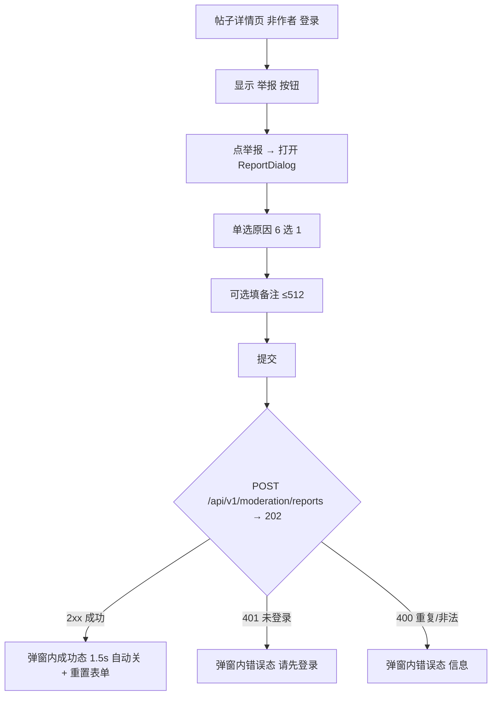

# 前端举报模块 设计

## 0. 需求摘要与决策

- **用户目标**：登录用户能举报不良帖子，提交后知道已受理。
- **核心行为**：帖子详情页（非作者）显示"举报"按钮 → 弹窗单选原因（6 种）+ 可选备注 → 提交 → toast"举报已提交"。
- **成功标准**：非作者登录用户能提交举报；提交成功 toast；不能举报自己帖子；重复举报同一帖返回已有举报不报错。
- **明确不做**（grep / 测试可反向核对）：
  - 不做评论举报（只帖子，下个 feature）
  - 不做举报状态查询（后端无接口，提交即结束）
  - 不做举报历史列表
  - 不改后端（后端 git diff 为空）
- **复杂度档位**：默认（1 service + 1 弹窗组件 + 详情页接入，无跨模块）。
- **关键决策**（owner 已拍板）：
  - D1 只举报帖子（评论举报下个 feature）
  - D2 提交后 toast"举报已提交，我们会尽快处理" + 关弹窗
  - D3 单选原因（6 种）+ 可选备注（≤512 字）

## 1. 决策与约束、风险与证据

### 1.1 结构归属

前端 `zhiguang_fe`。service 层加 `moderationService.report`；新建举报弹窗组件 `ReportDialog.tsx`；帖子详情页 `CourseDetailPage.tsx` 接入。后端零改动。

### 1.2 Top 3 风险

- **R1（最可能实现偏）**：targetId 是 snowflake Long，前端要 string 化防精度丢失（对齐评论/通知 id string 约定）。
- **R2（最易验收遗漏）**：不能举报自己帖子——**后端无 self-report 校验**（resolveOwner 不判 owner==reporter），前端隐藏按钮是唯一防线。漏隐藏就出 bug。
- **R3（最易回归）**：重复举报同一帖——后端返回 existing（幂等），前端 toast 应成功不报错。

### 1.3 非显然依赖

- 举报接口需鉴权（`@AuthenticationPrincipal Jwt`），未登录 401 → 隐藏举报按钮
- targetId 是 `Long`（@Positive），前端传 string，Spring 自动转 Long
- reason 须合法枚举：`spam/harassment/violence/pornography/illegal/other`（`ModerationReason.isSupported`）
- targetType 只允许 `"post"` 或 `"comment"`（本 feature 只用 `"post"`）
- 后端去重：同人同对象已举报返回 existing `{reportId, status}`，不报错

### 1.4 关键假设

- **已验证事实**（读 `ModerationReportController` + DTO + Service 确认）：
  - `POST /api/v1/moderation/reports` body `{targetType: String, targetId: Long(@Positive), reason: String, description: String(≤512, 可选)}` → **202 ACCEPTED** + `ModerationReportResponse {reportId: Long, status: String}`
  - targetType 只允许 "post"/"comment"；reason 须 ModerationReason.isSupported（spam/harassment/violence/pornography/illegal/other）
  - 后端去重（同人同对象返回 existing）+ resolveOwner 校验目标存在/状态
  - **后端无 self-report 校验**（resolveOwner 只查目标存在，不判 owner==reporter）→ 前端隐藏按钮是唯一防线（B1）
  - reportId 是 snowflake Long，**后端 DTO 需改 String**（对齐通知/评论 snowflake string 先例，B3 修复）
- 假设：帖子详情页 `detail.id` 是 string（前端 KnowpostDetailResponse.id 已 string 化）

### 1.5 必跑验证命令与基线风险

- 前端 `npm run lint`（基线应绿）
- 后端 `mvn spring-boot:run`（8080）+ curl 举报接口带 token
- 浏览器肉眼验证按钮 + 弹窗 + toast
- **基线风险**：无（举报接口已 ready）

### 1.6 交付物清单

- 新增：`services/moderationService.ts`
- 新增：`types/moderation.ts`
- 新增：`components/common/ReportDialog.tsx` + `.module.css`
- 修改：`pages/CourseDetailPage.tsx`（加举报按钮 + 弹窗接入）
- 无后端改动、无新路由

### 1.7 清洁度规则

- 禁 `console.log` / TODO / FIXME / 注释代码 / 死 import

## 2. 名词层与编排层

### 2.1 名词层

**现状**：无举报相关 service/types/组件（grep 确认）。

**变化**：
```ts
// types/moderation.ts
export type ModerationTargetType = "post" | "comment";
export type ModerationReason = "spam" | "harassment" | "violence" | "pornography" | "illegal" | "other";
export type ModerationReportRequest = {
  targetType: ModerationTargetType;
  targetId: string;  // snowflake Long → string 防精度
  reason: ModerationReason;
  description?: string;  // ≤512 字，空串/纯空格前端传 undefined（后端 blankToNull 存 null）
};
export type ModerationReportResponse = {
  reportId: string;  // snowflake Long → string
  status: string;
};

// services/moderationService.ts
report(payload: ModerationReportRequest, accessToken: string) → ModerationReportResponse  // POST /api/v1/moderation/reports → 202
```

### 2.2 编排层



**流程级约束**：
- 权限：仅登录（`!!tokens?.accessToken`，同 FollowButton）+ 非作者显示举报按钮（`derivedId && !isSelf`）。**后端无 self-report 校验，前端隐藏是唯一防线**（B1）
- 幂等：后端去重返回 existing，前端当成功处理（显示成功态）
- 防重复提交：提交中按钮 disabled（loading）
- targetId string：detail.id 原样传（已 string）
- 提交成功反馈（I1，不引入 toast 组件）：ReportDialog 内显示"举报已提交，我们会尽快处理"成功态文案 1.5s 后自动关闭 + 重置表单 state（N1）。失败显示错误态文案，不关弹窗

### 2.3 挂载点清单（删了它 feature 是否消失）

- M1 CourseDetailPage 举报按钮（非作者登录显示）——删 → 无入口
- M2 ReportDialog 弹窗组件——删 → 无表单
- M3 moderationService.report 方法——删 → 无接口
- M4 types/moderation——删 → 无类型

反向核对：grep `moderationService` / `ReportDialog` 落点都在清单内。

### 2.4 推进策略（paradigm 切片）

- **step1 service + types + 后端 DTO string 化**：moderationService.report + types/moderation + 后端 ModerationReportResponse reportId Long→String（3 处构造 String.valueOf + 测试适配）。`exit_signal`：lint 绿 + 后端 mvn compile 通过 + curl 举报带 token 返回 2xx（202 ACCEPTED）+ reportId（string）。
- **step2 ReportDialog + 详情页接入 + harden**：弹窗组件（单选原因 + 备注 + 提交）+ CourseDetailPage 加举报按钮 + toast + 防重复 + 清洁度。`exit_signal`：lint 绿 + 浏览器登录非作者看举报按钮 + 弹窗 + 提交 toast。

### 2.5 结构健康度与微重构

评估前查 compound：无目录组织 convention。

- **文件级**：CourseDetailPage.tsx 现状偏大，本次加举报按钮 + 弹窗 state 约 +20 行，可接受（逻辑内聚）。结论：**不做微重构**。
- **目录级**：components/common/ 已有弹窗类组件先例（RelationListModal）。无 convention 候选。
- **超出范围的观察**：无。

## 3. 验收契约

- **S1 举报按钮显示**：登录 + 非作者看帖子详情页，显示"举报"按钮；作者/未登录不显示。证据：浏览器
- **S2 弹窗表单**：点举报 → 弹窗单选原因（6 种）+ 可选备注（≤512）。证据：浏览器
- **S3 提交成功反馈**：选原因 + 提交 → POST 202 成功 → 弹窗内"举报已提交，我们会尽快处理"成功态 1.5s 自动关 + 重置表单。证据：浏览器 Network
- **S4 重复举报幂等**：同一帖再次举报 → 后端返回 existing → 前端当成功（成功态，不报错）。证据：curl + 浏览器
- **S5 不能举报自己**：作者看自己帖子无举报按钮（前端隐藏，**后端无强校验**——curl 反向核对：作者 token 举报自己帖后端实际受理 202，已知 gap，本 feature 不修后端，记遗留）。证据：浏览器 + curl
- **S6 未登录无按钮**：未登录（!tokens?.accessToken）无举报按钮。证据：浏览器
- **S7 id string 精度**：Network 请求 targetId 是 string；响应 reportId 是 string（后端 DTO 改 String 后）。证据：浏览器 Network
- **反向核对（明确不做）**：grep 无评论举报逻辑（CommentSection 无 ReportDialog）；无状态查询；后端 git diff 为空

### Acceptance Coverage Matrix

| 场景 | step | 证据类型 | 命令 / 动作 |
|---|---|---|---|
| S1 按钮显示 | 2 | 浏览器 | 登录非作者看详情页 |
| S2 弹窗表单 | 2 | 浏览器 | 点举报看弹窗 |
| S3 提交 toast | 2 | 浏览器 Network | 提交看 POST + toast |
| S4 重复幂等 | 2 | curl + 浏览器 | 同帖再举报 |
| S5 不举报自己 | 2 | 浏览器 | 作者看自己帖 |
| S6 未登录无按钮 | 2 | 浏览器 | 未登录看 |
| S7 targetId string | 2 | 浏览器 Network | targetId 是 string |

### DoD Contract

- Design DoD：名词层 / 编排层 / 挂载点 / 验收契约 / steps 全填，本文件 approved
- Implementation DoD：2 step 全 done
- Review DoD：`cs-code-review` passed
- QA DoD：`cs-feat-qa` passed
- Acceptance DoD：7 节核对 + 最终审计
- Validation Commands：`npm run lint`、curl 举报接口、浏览器
- Required Artifacts：moderationService.ts、types/moderation.ts、ReportDialog.tsx、CourseDetailPage.tsx、design.md、checklist.yaml

## 4. 后续衔接

- **attention 候选**：无（举报 reason 枚举是后端契约，前端对齐即可）
- **compound 候选**：无
- **遗留**：评论举报（D1 不做，下个 feature）；举报状态查询（后端无接口，后续）；举报历史列表（不做）；**后端缺 self-report 强校验**（前端隐藏是唯一防线，评论举报 feature 前应评估补后端校验，否则缺口放大）；reportId 响应已 string 化（B3 修复，后端 DTO 改 String）
