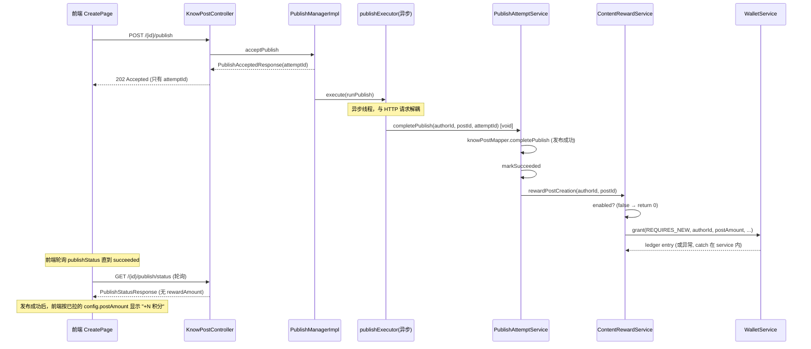
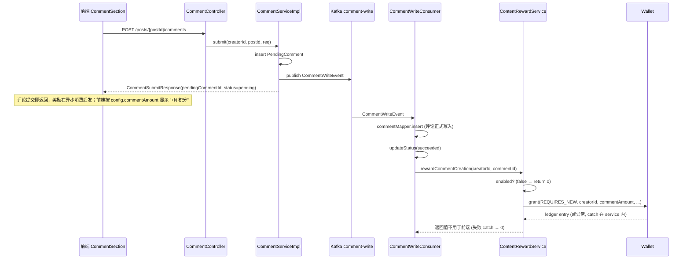

# 内容创作积分奖励 方案设计

## 0. 术语与背景

- **积分** = wallet 的 `available_balance`（可用余额）。推广竞价已用它出价。本次给积分增加"内容创作"获取来源。
- **grant**：`WalletService.grant(ownerUserId, amount, reason, businessType, businessRef)`，平台账本向用户发放虚拟货币。注册赠币已用此路径。
- **businessRef 幂等**：`wallet_business_ref` 表 PK = businessRef，`apply` 内部对同 ref + 同操作重试幂等返回，不同操作 reject。**内容奖励直接复用此机制，无需外层查重。**

需求输入（owner 拍板 4 决策）：发帖发布成功同步发 / 评论创建成功同步发 / 金额发帖 10 评论 2 可配置 / 前端提示 "+N 积分"。

## 1. 决策与约束

### 目标
发帖 / 发评论成功后，向创作者钱包发放可配置积分奖励，让用户有持续获取积分途径（竞价消费端已就绪）。

### 核心行为
- 发帖发布成功（`completePublish` 走完）→ 作者 wallet +postAmount 积分
- 评论正式写入成功（`CommentWriteConsumer` insert 成功）→ 评论者 wallet +commentAmount 积分
- 同一帖子 / 同一评论只发一次（businessRef 幂等）
- 奖励发放失败不阻塞发帖 / 发评论主流程

### 明确不做
- 不做"点赞 / 收藏 / 关注"等互动行为的奖励（仅创作行为）
- 不做每日上限 / 频率限制 / 反作弊（v1 简单发放，后续可扩展）
- 不做奖励通知推送（仅前端提交时轻提示 + wallet 余额变化）
- 不动推广竞价的积分消费端
- 不改 wallet grant / apply 内部实现

### 复杂度档位
走默认档位（无对外 SDK / 无高并发 / 无一次性工具偏离信号）。

### Top 3 风险
1. **评论侧 REQUIRES_NEW rollback-only 陷阱**（最难回滚）：`CommentWriteConsumer.handle` 是 `@Transactional`，reward 子事务回滚异常若被 caller catch 会让外层 rollback-only。缓解：catch 必须在 `ContentRewardService` 方法体内（不冒泡 caller），AC8 两层证据（单测 + 手工集成）验证非受检异常下评论仍提交。发帖侧 completePublish 调用方 runPublish 无外层事务，REQUIRES_NEW 天然隔离，风险较低。
2. **发帖 rewardAmount 回传链路**（最易实现偏）：completePublish 在异步线程返回 void，不回流 HTTP 响应。缓解：发帖金额走 config 接口，不改 PublishStatusResponse（design 已修订）。
3. **评论异步链路挂载点**（最易验收遗漏）：评论创建是 Kafka 异步（CommentWriteConsumer），挂错点会发错时机 / 发不到。缓解：design 已锁定 `CommentWriteConsumer.handle` 的 `updateStatus(succeeded)` 后；AC5 拆两条幂等路径验证。

### 非显然依赖
- `WalletService.grant` 内置 businessRef 幂等——依赖此机制防重，不外层查重。
- 评论创建异步（Kafka `comment-write` topic）——奖励挂 consumer 而非 `submit`。
- 本地 Kafka 已起（`zhiguang-kafka`）——评论 consumer 本地可消费，不依赖 canal。
- 发帖 `completePublish` 在 `publishExecutor` 异步线程执行返回 void——reward 在此调用，但金额不回流 HTTP，走 config 接口。

### 关键决策（owner 已拍板 + review 确认）
- **A1**：`WalletBusinessType` **新增 `CONTENT`**（不复用 `BOUNTY`）。证据：`BOUNTY` 全仓库 grep 只在 `WalletBusinessType.java:9` 枚举定义处 1 行命中，无任何使用（dead enum）；"赏金"语义（任务悬赏）与"内容创作奖励"（无条件激励）不重合，复用 dead enum 反而脏。新增 `CONTENT` 独立承载内容创作语义。
- **A2**：前端 "+N 积分" 金额来源 = `GET /api/v1/content-reward/config` 返回的 postAmount/commentAmount，前端启动时拉一次缓存。**不改任何 DTO**（PublishStatusResponse / CommentSubmitResponse 都不加 rewardAmount）。
- **A3**：奖励 `enabled=false` 时，config 接口仍返回真实金额但前端按 enabled 判断不显示 "+N 积分"。

### 必跑验证命令
- 后端：`mvn -Dtest='**/wallet/**,**/comment/**,**/knowpost/**' test`（wallet / comment / knowpost 相关测试全过）
- 前端：`cd zhiguang_fe && npm run lint`（tsc 类型检查绿）
- 端到端：`mvn spring-boot:run`（bprime 不需要开）+ 前端 `npm run dev`，浏览器发帖 / 发评论后看 wallet 余额 + 前端提示
- 基线风险：promotion 全量测试有 1 个既有 flaky（`PromotionMysqlIntegrationTest`），与本 feature 无关，预检时忽略

### 交付物清单
- 新增：`ContentRewardService` + `ContentRewardProperties` + `ContentRewardController` + `ContentRewardConfigResponse` + `WalletLedgerReason.CONTENT_CREATION_REWARD` + `WalletBusinessType.CONTENT`
- 修改：`PublishAttemptService.completePublish`（调奖励）、`CommentWriteConsumer.handle`（调奖励）、application.yml（奖励配置）
- **不改任何 DTO**：`PublishStatusResponse` / `CommentSubmitResponse` 均不加 rewardAmount（金额走 config 接口）
- 前端：`CreatePage.tsx`（发布成功提示）、`CommentSection.tsx`（评论提交提示）、新增 `contentRewardService.ts`（config 拉取）
- 配置 key：`content-reward.enabled` / `content-reward.post-amount` / `content-reward.comment-amount`

### 清洁度规则
- 不新增 console.log / print 调试输出
- 奖励失败日志用项目既有 logger（slf4j），warn 级别，带 businessRef 便于排查
- 无临时 TODO/FIXME、无注释掉代码、无无用 import

## 2. 名词层与编排层

### 2.1 名词层

#### 现状
- `WalletLedgerReason`（`wallet/model/WalletLedgerReason.java`）：枚举含 REGISTRATION_GRANT / PLATFORM_SUBSIDY / PROMOTION_* / ESCROW_*，**无内容创作奖励**。
- `WalletBusinessType`（`wallet/model/WalletBusinessType.java`）：REGISTRATION / PROMOTION / BOUNTY / SYSTEM。
- `WalletService.grant(ownerUserId, amount, reason, businessType, businessRef)`（:68）：发积分入口，内置 businessRef 幂等。
- `PublishStatusResponse`（`knowpost/api/dto/PublishStatusResponse.java`）：返回 attemptId / status / postStatus / failedStep / retryable，**无奖励字段**。
- `CommentSubmitResponse`（`comment/api/dto/CommentSubmitResponse.java`）：返回 clientRequestId / pendingCommentId / status，**无奖励字段**。

#### 变化
- 新增枚举 `WalletLedgerReason.CONTENT_CREATION_REWARD`（A1 待确认：`WalletBusinessType` 新增 `CONTENT` 或复用 `BOUNTY`，倾向新增 `CONTENT`）。
- 新增 `ContentRewardProperties`（`@ConfigurationProperties("content-reward")`）：`boolean enabled` / `long postAmount` / `long commentAmount`，默认 true / 10 / 2。
- 新增 `ContentRewardService`（`wallet/service/` 或新建 `content/service/`，见 2.5）：
  ```java
  // 行为示例
  rewardService.rewardPostCreation(authorId, postId)
    // enabled=false → no-op；enabled → grant(authorId, postAmount, CONTENT_CREATION_REWARD, CONTENT, "content-reward:post:"+postId)
    // 失败 → try-catch + warn 日志，不 throw
  rewardService.rewardCommentCreation(creatorId, commentId)
    // 同上，businessRef="content-reward:comment:"+commentId
  ```
  - `@Transactional(propagation = REQUIRES_NEW)` 独立事务，grant 失败不影响主事务。
  - **catch 必须在 service 方法体内**（`rewardPostCreation` / `rewardCommentCreation` 内 try-catch 吞所有 `Exception` 返回 0，异常不冒泡 caller）。原因：REQUIRES_NEW 子事务回滚抛异常，若被 caller（如 `CommentWriteConsumer.handle` 的 `@Transactional`）catch，外层事务仍可能被 Spring 标记 rollback-only（UnexpectedRollbackException 陷阱）。catch 在子事务方法体内，异常不进入外层事务边界，才能真正隔离。
  - 返回 `long`（实际发放金额，enabled=false 或失败返回 0），供调用方记日志/排查。**调用方不依赖返回值驱动前端**（前端金额走 config 接口，见 §2.2）。
- **不改 `PublishStatusResponse` / `CommentSubmitResponse`**（不加 rewardAmount）。原因：发帖 `completePublish` 在异步线程执行返回 void，不回流 HTTP 响应（见 §2.2）；评论提交时奖励还没发（异步）。前端 "+N 积分" 金额统一走 `GET /api/v1/content-reward/config`（A2-b 已定）。

> businessRef 格式：`content-reward:post:{postId}` / `content-reward:comment:{commentId}`。grant 内置幂等保证同帖 / 同评论重试只发一次。

### 2.2 编排层

主流程（发帖）—— **completePublish 在异步线程，返回 void，不回流 HTTP 响应**：


> **发帖金额来源**：`completePublish` 返回 void 在异步线程，无法把 rewardAmount 回传 HTTP 响应。前端 "+N 积分" 的金额走 `GET /api/v1/content-reward/config`（启动时拉一次缓存），发布成功后按 config.postAmount 显示。**不改 `PublishStatusResponse`**。

主流程（评论）：


> **评论金额来源**：评论提交时（submit）奖励还没发（异步），`CommentSubmitResponse` 不加 rewardAmount。前端按 `GET /api/v1/content-reward/config` 的 commentAmount 显示。

> **config 接口**（A2-b 已定）：新增 `GET /api/v1/content-reward/config`，返回 `{enabled, postAmount, commentAmount}`。**需登录态访问**（非公开——金额配置轻敏感，前端用例都登录态）。不加 SecurityConfig permitAll 白名单，走默认 `anyRequest().authenticated()`。前端用带 token 的 apiClient 调，启动时拉一次缓存内存。

错误语义（**catch 必须在 ContentRewardService 方法体内，不冒泡 caller**）：
- grant 抛 `BusinessException(WALLET_NOT_FOUND)`（用户无钱包）→ service 内 catch + warn 日志，返回 0，不阻塞。
- grant 抛 `WALLET_DUPLICATE_BUSINESS_REF`（同 ref 不同操作，理论不会发生）→ service 内 catch + warn，返回 0。
- grant 抛其他 `Exception`（含非受检如 DataAccessException）→ service 内 catch + warn，返回 0。
- REQUIRES_NEW 子事务回滚异常被 service 内 catch 吞掉，**异常不进入 caller 事务边界**，避免外层 `@Transactional`（CommentWriteConsumer.handle）被标记 rollback-only。发帖侧 completePublish 调用方 runPublish 无外层事务，REQUIRES_NEW 天然隔离。

幂等性：
- 发帖：`completePublish` 重试（前端轮询 status 触发）时，同 postId 的 businessRef 已存在，grant 幂等返回既有 entry，不重复发。
- 评论：`CommentWriteConsumer` `@RetryableTopic` 重试时，同 commentId 的 businessRef 已存在，grant 幂等返回。

### 2.3 挂载点

按"删了它 feature 是否消失"判据：
1. `ContentRewardService`（新增服务）— 删了则无奖励发放逻辑。
2. `PublishAttemptService.completePublish` 调 `rewardPostCreation` — 删了则发帖不发奖励。
3. `CommentWriteConsumer.handle` 调 `rewardCommentCreation` — 删了则评论不发奖励。
4. `content-reward.*` 配置项（application.yml）— 删了则用默认值，但配置不可调。
5. 前端 `CreatePage` / `CommentSection` 的 "+N 积分" 提示 — 删了则用户无即时反馈（但 wallet 余额仍变）。
6. `GET /api/v1/content-reward/config` 接口（ContentRewardController）— 删了则前端拿不到配置金额。**需登录态**（走默认 `anyRequest().authenticated()`，不加 SecurityConfig permitAll）。

> 反向核对（明确不发奖励的路径）：`failPublish`（PublishAttemptService:177+，发布失败）/ `recoverStuckPublishingAttempts`（stuck 恢复走 failPublish）— 发布未成功，**不发奖励**。reward 只挂在 `completePublish` 成功路径。

### 2.4 推进策略

按 paradigm 维度切片：

| step | 内容 | exit_signal | 验证动作 | 交付物 |
|---|---|---|---|---|
| 1 | 新增枚举 + Properties + ContentRewardService 骨架 + 单测 | 编译过 + 单测（grant 调用 / enabled=false no-op / 异常 catch 在 service 内返回 0 / 幂等重试只调一次） | mvn test | 4 个新文件（枚举×2 + Properties + Service + Test） |
| 2 | 发帖挂载：completePublish markSucceeded 后调 rewardPostCreation（不改任何 DTO） | 发帖测试过 + 余额增加 + 重试不重发 + reward 失败不阻塞发布 | mvn test + 手工 curl | PublishAttemptService 改 |
| 3 | 评论挂载 + config 接口：CommentWriteConsumer 调 rewardCommentCreation + 新增 ContentRewardController（GET /api/v1/content-reward/config，需登录态） | 评论测试过 + 余额增加 + 重试不重发（两条路径）+ config 接口带 token 返回配置 | mvn test + 手工 curl | CommentWriteConsumer 改 + ContentRewardController + ConfigResponse DTO |
| 4 | 前端：CreatePage 发布成功提示 + CommentSection 评论提示 + contentRewardService.config 拉取 | lint 绿 + 浏览器发帖 / 评论显示 "+N 积分"（金额来自 config） | npm run lint + 浏览器 | 2 个前端文件改 + 1 个新 service |

### 2.5 结构健康度与微重构

**文件级评估**：
- `PublishAttemptService`（~280 行）：本次只加一行 `rewardService.rewardPostCreation(...)` 调用，不胖，无需拆。
- `CommentWriteConsumer`（~133 行）：本次只加一行调用，不胖，无需拆。
- `WalletService`：不改，只调 grant。
- `WalletLedgerReason` / `WalletBusinessType`：加枚举值，无健康问题。

**目录级评估**：
- `ContentRewardService` 放哪？选项：① `wallet/service/`（与 WalletService 同包，奖励属钱包使用方）② 新建 `content/service/`（内容奖励独立模块）。
- **倾向 ①** `wallet/service/`：奖励本质是 wallet 操作的编排，与 `WalletRegistrationGrantService`（注册赠币，同在 wallet/service）范式一致。新建 `content/` 包只放一个 service 过早抽象。
- compound 无目录组织 convention 命中。

**结论**：本次不做微重构。`ContentRewardService` 落 `wallet/service/`，与 `WalletRegistrationGrantService` 并列。

**超出范围的观察**（仅提示，不阻塞）：
- `WalletRegistrationGrantService` 与 `ContentRewardService` 都是"调 grant 发奖励"的编排，未来若有更多奖励场景（签到 / 活动），可考虑抽 `RewardGrantTemplate`。本次不做，过早抽象。

## 3. 验收契约

### 正常路径
- **AC1**：发帖发布成功 → 作者 wallet available_balance +postAmount（默认 10），`wallet_ledger` 有一条 reason=CONTENT_CREATION_REWARD / businessRef=`content-reward:post:{postId}` 的 CREDIT 记录。证据：DB 查询 + 单测。
- **AC2**：发评论成功 → 评论者 wallet available_balance +commentAmount（默认 2），ledger 有 reason=CONTENT_CREATION_REWARD / businessRef=`content-reward:comment:{commentId}` 记录。证据：DB + 单测。
- **AC3**：前端发帖成功后显示 "+10 积分"（按配置），发评论后显示 "+2 积分"。证据：浏览器截图。

### 边界
- **AC4**：`completePublish` 重试（同 postId 多次走 completePublish）→ 只发一次奖励（grant 幂等）。证据：单测 + ledger 表 count=1。
- **AC5a**：`CommentWriteConsumer` `@RetryableTopic` 重试（reward 成功后重试）→ businessRef 幂等只发一次。证据：单测 + ledger count=1。
- **AC5b**：reward 失败（grant 抛异常被 service catch 返回 0）→ 评论仍 succeeded（updateStatus 已执行）+ ledger 无记录 + 重试走 status==succeeded 短路**不补发**。**接受丢失**（v1 设计取舍：reward 挂 updateStatus 后，失败不阻塞评论，极少数 grant 失败时丢一次积分，评论不丢）。证据：单测（mock grant 抛异常，断言 service 返回 0 + 评论 succeeded）。
- **AC6**：`content-reward.enabled=false` → 不发奖励（grant 不调），前端不显示 "+N 积分"。证据：单测 + 配置切换手工。

### 错误路径
- **AC7**：用户无钱包（wallet_account 无记录）→ grant 抛 WALLET_NOT_FOUND → service 内 catch + warn 日志 → 发帖 / 评论主流程不受影响（帖子发布成功 / 评论写入成功）。证据：单测（mock walletService 抛 BusinessException，断言 service 返回 0 不 throw）。
- **AC8**：grant 抛任意异常（含非受检如 RuntimeException/DataAccessException）→ service 内 catch 不冒泡 caller → 评论主事务不回滚（comment insert + updateStatus succeeded 落库）。证据：**两层**——单测层（mock grant 抛 RuntimeException，断言 service 返回 0 不 throw）+ **手工集成层**（mock wallet 抛异常后 curl 发评论，评论成功 + ledger 无记录 + 评论表 status=succeeded）。注：项目测试是 MockMvc standalone（不起真实事务管理器），REQUIRES_NEW 隔离在单测层不可证伪，必须手工集成验证。

### 明确不做（反向核对）
- **AC9**：点赞 / 收藏 / 关注 / failPublish / stuck 恢复 不触发奖励（grep 确认 reward 调用只挂在 completePublish 成功路径 + CommentWriteConsumer.handle）。证据：grep。
- **AC10**：无每日上限 / 频率限制逻辑（连发 3 条评论各得 2 积分）。证据：手工。

### Acceptance Coverage Matrix
| 场景 | step | 证据类型 | 命令/动作 |
|---|---|---|---|
| AC1 发帖奖励 | 2 | 单测 + DB | mvn test + curl 发帖后查 wallet/ledger |
| AC2 评论奖励 | 3 | 单测 + DB | mvn test + curl 评论后查 wallet/ledger |
| AC3 前端提示（金额来自 config） | 4 | 浏览器截图 | npm run dev 发帖/评论，显示 config 的 postAmount/commentAmount |
| AC4 发帖幂等 | 2 | 单测 | mock 重试 completePublish，grant 内置幂等 ledger count=1 |
| AC5a 评论幂等（reward 成功后重试） | 3 | 单测 | mock reward 成功后重试 consumer，businessRef 幂等 ledger count=1 |
| AC5b 评论幂等（reward 前异常重试） | 3 | 单测 | mock reward 前抛异常，第一次未发，重试后正常发一次 ledger count=1 |
| AC6 enabled=false | 1,4 | 单测 + 手工 | 配置切换，前端不显示提示 |
| AC7 无钱包不阻塞 | 1 | 单测 | mock grant 抛 BusinessException，service 返回 0 不 throw |
| AC8 主事务不回滚 | 2,3 | 单测 + 手工集成 | 单测 service catch；手工 mock wallet 抛 RuntimeException 发评论，评论成功 + ledger 无记录 |
| config 接口 | 3 | 手工 curl | 带 token curl /api/v1/content-reward/config 返回 {enabled, postAmount, commentAmount} |

### DoD Contract
- Design DoD：本 design approved。
- Implementation DoD：4 step checklist 全 done + mvn test / npm lint 绿。
- Review DoD：`cs-code-review` passed。
- QA DoD：`cs-feat-qa` passed（含浏览器实测发帖/评论奖励 + AC8 手工集成验证）。
- Acceptance DoD：AC1-AC10 + config 接口全过 + 交付物清单仓库事实核验。

## 4. 架构回写预判

无架构文档 / requirement / roadmap 需回写（requirements 目录空）。本次纯新增功能，不改现有架构边界。

compound 沉淀建议（implement 后走 cs-keep）：
- **L1**：Spring `@Transactional(REQUIRES_NEW)` rollback-only 陷阱——子事务回滚异常即使被外层 catch，外层仍可能 rollback-only；正确做法 catch 写在子事务方法体内。本次踩坑，值得沉淀供未来"主事务内调独立子事务 + 容错"参考。
- **L2**：`BOUNTY` 是 dead enum（全仓库无使用），勿复用。

## 5. 自我批判

1. **可证伪性**：AC1-AC10 + config 全是 yes/no（余额变 / ledger 有 / count=1 / 不显示 / 返回字段），无"体验良好"类弱标准。✓
2. **步骤原子性**：4 step 各自独立可验证（step1 服务骨架单测 / step2 发帖 / step3 评论+config / step4 前端），无耦合。✓
3. **最弱依赖**：step1 是基础（服务 + 枚举），step2/3 依赖 step1，step4 依赖 step3 的 config 接口。顺序合理。✓
4. **证据完整性**：每条 AC 有证据类型。AC8 两层证据（单测 + 手工集成）。前端 AC3 需浏览器截图。✓
5. **基线可执行性**：mvn test / npm lint 命令明确，既有 flaky 已说明。✓
6. **交付物可核验性**：交付物清单可从 git diff / 配置文件 / DB 核验。✓
7. **清洁度覆盖**：已写清调试输出 / TODO / import 口径。✓
8. **接口深度**：`ContentRewardService` 对外 2 方法（rewardPostCreation / rewardCommentCreation），caller 只需传 id，无需知道 grant / businessRef / 配置——deep module。✓

**关键决策已全部拍板**（A1 新增 CONTENT / A2 config 接口 / A3 enabled=false 不显示），无待定假设。
